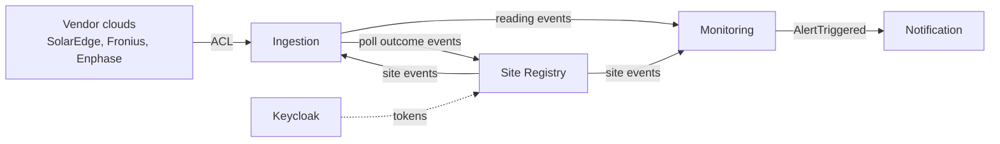
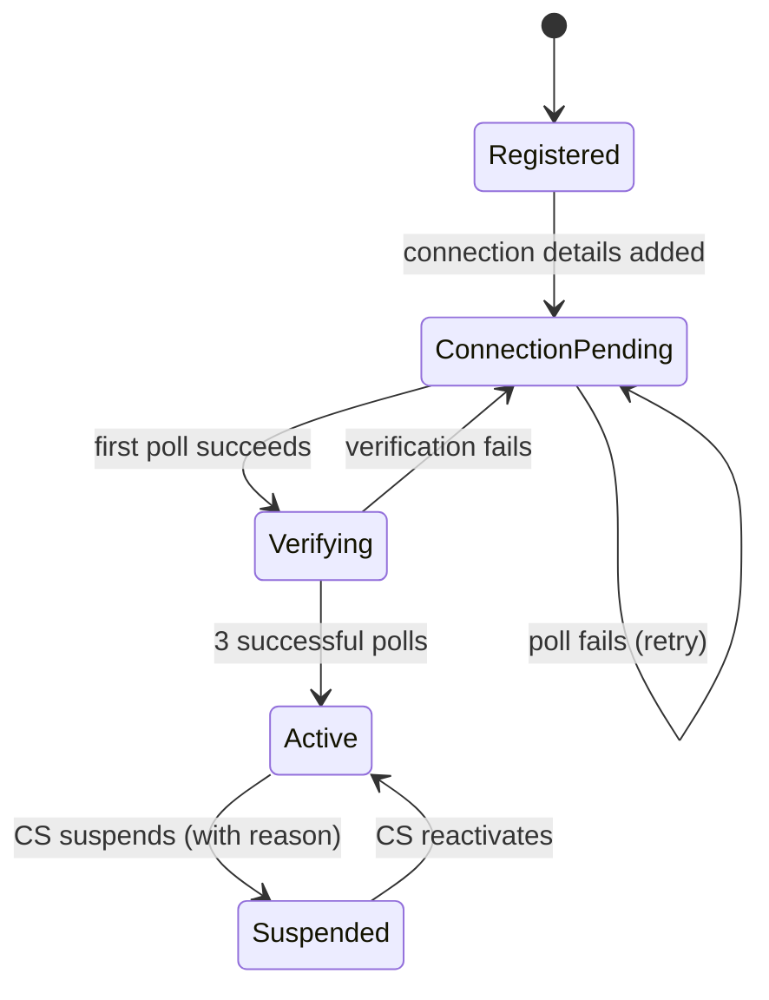
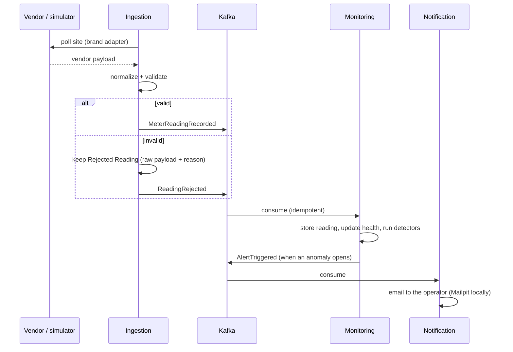

# GreenGrid — domain overview

> Adapted from Part I of *GreenGrid — Java Microservices Edition: Spec & Build Guide* (Sep 24, 2026), with the decisions taken in the research clarifications of 2026-09-27 (`docs/research/2026-09-27-greengrid-spec-baseline.md` §8). Terms in **bold** are defined in [ubiquitous-language.md](ubiquitous-language.md); rules and stories are in [requirements.md](requirements.md).

## The client and the problem

GreenGrid Solutions (fictional) helps prosumers — households and businesses that both produce and consume energy — see what their solar installation is doing. Installers refer new customers; GreenGrid connects to the inverter vendor's cloud, verifies that data flows, and then monitors the site. About 200 sites in 3 regions are monitored today by one person with a spreadsheet.

| Person | Role | Needs from the system |
|---|---|---|
| Sana | Product Owner | A credible replacement for spreadsheets and fragile scripts |
| Diana | Operations (**Operator**) | Know within minutes, not days, when a site is unhealthy |
| Tomás, Maria | Customer Success (**CS Agent**) | Track each site from registration to active; spot failed connections early |
| Customers | Site owners | See whether their system works and what it produced |

Pain points the system must remove:
- **Manual monitoring** — a site that stops sending data goes unnoticed for 2–3 days; customers report outages first.
- **Fragile ingestion** — three inverter brands (SolarEdge, Fronius, Enphase), each with its own API, auth and interval (5 min to 1 h); the old cron scripts fail silently.
- **Ambiguous zeros** — zero production can mean a broken site, a broken API or a cloudy day (or simply night).
- **Silent rejection** — future-dated readings were once dropped for three days without anyone noticing; contracts require proof of data completeness.
- **Opaque onboarding** — 2 days to 2 weeks, many failed first connections, progress on a printed checklist.

Out of scope for the PoC: frontend (demos run through Bruno requests and metrics UIs), real vendor APIs (a simulator replaces them), billing and payback, multi-tenancy beyond the customer ownership check, production-grade secret management, real AWS deployment. Parked from discovery: co-op per-resident attribution, payback and savings, year-over-year comparisons, usage optimization, energy trading.

## The solution in one paragraph

Small services, one per bounded context, communicating through Kafka events. **Site Registry** owns sites and their onboarding lifecycle. **Ingestion** polls each vendor through a brand-specific adapter (anti-corruption layer), validates and normalizes readings, and keeps rejected readings for audit and review. **Monitoring** stores readings as time series, derives **Site Health**, detects **Anomalies** against **Thresholds** it owns, and raises **Alerts**. **Notification** delivers alerts by email. A gateway and Keycloak secure everything; the system is deployed by GitOps to a local Kubernetes cluster.

## Bounded contexts

| Context / service | Subdomain type | Owns | Why it is separate |
|---|---|---|---|
| Site Registry (`site-registry`) | Supporting | Sites, installations, connections, onboarding lifecycle | GreenGrid-specific process; changes with business rules |
| Ingestion (`ingestion`) | Supporting | Reading sources, polling, vendor adapters, validation, rejected readings | Vendor APIs fail often and differ; load grows with sites × poll frequency |
| Monitoring (`monitoring`) | **Core** | Readings time series, site health, baseline, thresholds, anomalies, alerts | What GreenGrid sells: knowing before the customer does |
| Notification (`notification`) | Generic | Sent notifications | Commodity delivery |
| Identity (Keycloak) | Generic | Users, roles, tokens | Buy, don't build |
| Gateway (`gateway`) | — | No data; routing and token checks | Single entry point |

Relationships: Registry is upstream of Ingestion and Monitoring and publishes versioned site events (open host service with a published language). Ingestion shields itself from vendor models with one adapter per brand and reports poll outcomes back to Registry, which drives onboarding. Ingestion is upstream of Monitoring through reading events; Monitoring is upstream of Notification. No service reads another's database and there is no service-to-service REST: the only synchronous calls are user → gateway → service and Ingestion → vendor.

## Site lifecycle

A **Site** belongs to one **Customer** and has an **Installation** (inverter brand, capacity in kWp, optional battery and smart meter). Before it is monitored, it goes through onboarding:

- Status changes happen only through these transitions; anything else is rejected as an invalid transition.
- Ingestion polls sites that are Verifying or Active. Suspension stops polling; reactivation resumes normal polling without re-verification (decided 2026-09-27, research Q-003).
- Health monitoring applies to Active sites only. Suspending a site resolves its open anomalies and shows its health as Unknown; activation and reactivation start the data-gap clock (decided 2026-09-27, research Q-012).
- Each site has a time zone (IANA, derived from its region at registration, overridable). Daylight windows and daily production use the site's local day (decided 2026-09-27, research Q-011).

## Key flows

**Onboarding verification.** Registry announces `SiteConnectionConfigured` → Ingestion creates a **Reading Source** in verification mode and polls → after the first success it reports `ReadingSourceVerified` with a running count → Registry moves the site to Verifying, then to Active after 3 successful polls and announces `SiteActivated` → Ingestion switches the source to normal mode.

**Reading to alert.**

**Anomaly handling.** Detectors open an **Anomaly** (at most one active per site and type) and raise one **Alert** per opening. Operators acknowledge it and may resolve it manually with a note (decided 2026-09-27, research Q-002); it also resolves automatically when the condition clears.

## Consistency and reliability (business view)

- No event is lost between saving state and telling other services (transactional outbox); consumers are idempotent, so a repeated event has no second effect.
- Events of one site are processed in order (all topics keyed by site id); late readings are placed by their own timestamp, not by arrival.
- Rejected readings are never dropped: they are kept with the raw payload, the reason and the review history (contractual proof of data completeness).
- Valid readings are recorded as events (Kafka is their system of record); Monitoring keeps its own time series.

## Why microservices here (and why not)

At GreenGrid's real size (200 sites, one small team) a modular monolith would be the better choice. This edition splits along the same boundaries deliberately, to demonstrate the skills, and the boundaries are sound because the contexts differ in change rate, load profile and failure mode. The costs — more deployables, eventual consistency, no cross-context joins, versioned event contracts — are accepted and documented in the ADRs (`docs/adr/`). If the services were merged back into modules, the domain code would not change.
