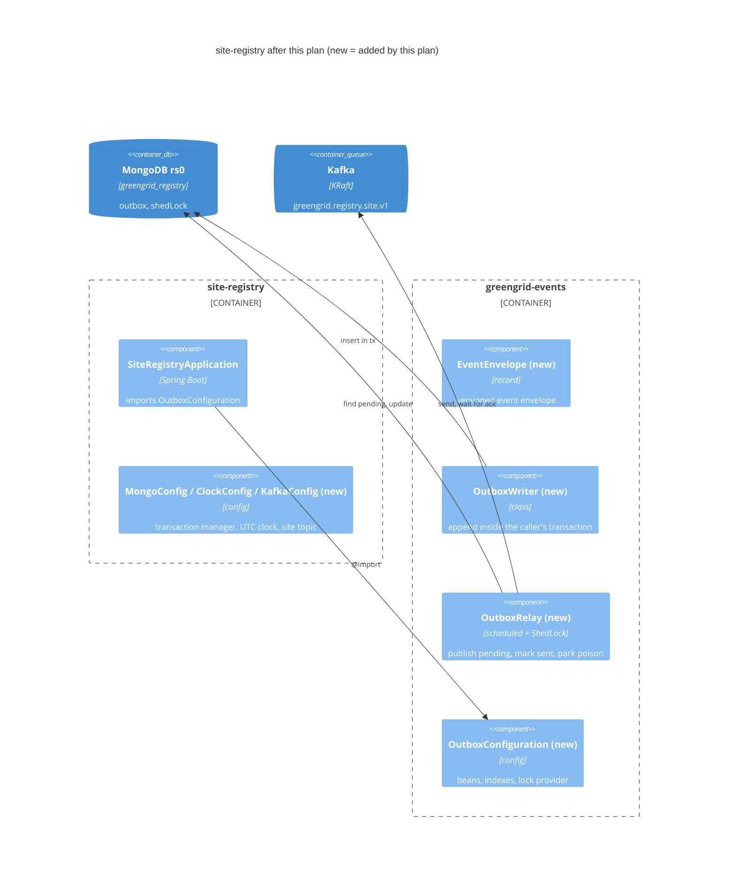
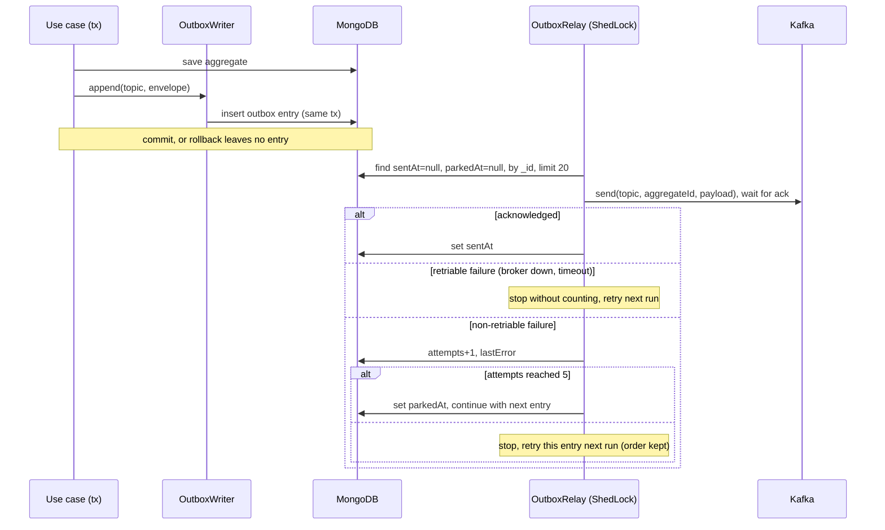

# Plan: Site Registry foundation and transactional outbox

## 1. Summary

**Goal:** the local stack starts reliably with one command, site-registry runs against it with real Mongo transactions and Kafka, and any event written through the shared outbox reaches Kafka at least once — even if the service dies between saving and publishing.
**Approach:** first repair the Compose stack and README so Chapter 1 is truly done (PLAT-02); then give site-registry the Chapter 2 foundation (dependencies, `application.yml`, transaction manager, clock, Testcontainers base, failsafe for `*IT` tests); finally implement the envelope, outbox writer and ShedLock-guarded relay in `greengrid-events`, wire them into site-registry and prove the three at-least-once guarantees plus poison-entry parking with `OutboxIT`.
**Research:** `docs/research/2026-09-27-greengrid-spec-baseline.md` (commit `9f310e4`) · **Slice:** BR-002, BR-003 + 9 inconsistencies · **Phases:** 3 · **Tasks:** 15

## 2. Scope

> Frozen after approval — changes go through iteration mode and §11.

### 2.1 In scope

| Ref | Research status | Plan intent |
|---|---|---|
| BR-002 | Partial | Complete: Compose stack healthy with one command (Phase 1) |
| BR-003 | Not implemented | Implement: envelope, transactional outbox, relay, parking (Phases 2–3) |
| INC-001 | Medium | Fix: each service gets its own name (T-004) |
| INC-003 | High | Fix: mongo1 `priority: 2` (T-003) |
| INC-004 | Medium | Fix: README uses `docker-compose.yaml` (T-005) |
| INC-005 | Medium | Fix: README "Run locally" section, 3.5.16 rationale, future work (T-005) |
| INC-007 | Low | Fix: events library implemented and used by site-registry (T-011…T-014) |
| INC-008 | High | Fix: `KAFKA_CONTROLLER_LISTENER_NAMES` (T-002) |
| INC-011 | Low | Fix: renormalize CRLF files (T-001) |
| INC-031 | Medium | Fix: poison entries parked, lock sized to the batch (T-014, D-003, D-004) |
| INC-035 | Low | Fix: README run-locally includes the `rs.status()` check (T-005) |

### 2.2 Not doing

| Ref | Reason | Target |
|---|---|---|
| BR-010…BR-015 | Site aggregate, REST and onboarding stories build on this foundation | next plan (REG-01/REG-02) |
| INC-006 | ArchUnit rules and broader test layers are Chapter 7; this plan only adds the Testcontainers base | Chapter 7 plan |
| INC-033 | Spring Cloud bump only matters for the gateway | Chapter 6 plan |

### 2.3 Inconsistency dispositions

| INC | Severity | Disposition | Tasks / reason |
|---|---|---|---|
| INC-001 | Medium | Fix | T-004 |
| INC-003 | High | Fix | T-003 |
| INC-004 | Medium | Fix | T-005 |
| INC-005 | Medium | Fix | T-005 |
| INC-007 | Low | Fix | T-011, T-012, T-013, T-014 |
| INC-008 | High | Fix | T-002 |
| INC-010 | Low | Won't fix | Keep `site_registry` (D-001); Chapter 2 paths are substituted |
| INC-011 | Low | Fix | T-001 |
| INC-020 | Medium | Defer | Per-service Mongo users belong with Kubernetes secrets (Q-007); recorded in ADR-003 (T-006) |
| INC-025 | Low | Won't fix | The spec file lives outside the repo; its author updates PLAT-01/PLAT-02 status after this plan |
| INC-031 | Medium | Fix | T-014 |
| INC-034 | Low | Defer | Topic retention and auto-creation belong to the readings plan (Q-015); the site topic is declared explicitly here (T-010) |
| INC-035 | Low | Fix | T-005 |

### 2.4 Global constraints

- Hexagonal packages under `com.greengrid.site_registry` (D-001): framework wiring only in `config`, persistence and messaging only in `adapter`/library; `domain` stays framework-free (CLAUDE.md; research §3.6).
- The events library is outside the services' component scan: every bean it provides is declared in `OutboxConfiguration` and imported explicitly (Spec L1125–1136).
- An event is written to `outbox` in the same Mongo transaction as the state change; the relay marks `sentAt` only after the broker acknowledged (BR-003; Spec L529).
- Kafka record key = `aggregateId` (per-site ordering; Spec L460, L1063).
- Versions: Spring Boot 3.5.16, Java 17, springdoc 2.8.9, ShedLock 5.16.0 via `<shedlock.version>`, images `mongo:7.0` and `apache/kafka:4.0.0` (Spec L240–245, L909, L1032).
- No dependency versions for anything the Boot/Cloud BOMs manage (Spec L894).
- Integration tests are named `*IT` and run in `verify` via failsafe; unit tests `*Test`/`*Tests` run in `test` (D-002).

### 2.5 Regression guards

- BR-001 — `./mvnw -B verify` from the repo root stays BUILD SUCCESS after every phase (from Phase 2 on it needs Docker for the site-registry tests).
- The four other services keep their single `contextLoads` test green (`services/ingestion/src/test/java/com/greengrid/ingestion/IngestionApplicationTests.java:9-11` and siblings).

## 3. Decisions

| ID | Resolves | Decision | Alternatives rejected | Rationale | ADR |
|---|---|---|---|---|---|
| D-001 | Q-005 | Keep package `com.greengrid.site_registry` | Rename to `siteregistry` | Documented in CLAUDE.md; spec allows substitution (Spec L888) | — |
| D-002 | — | Bind `maven-failsafe-plugin` in the root POM; integration tests are `*IT` | Rename ITs to `*Tests` for surefire | Keeps the spec's test names; fast `test` phase, full `verify` | — |
| D-003 | Q-016 | Relay classifies send failures: retriable ones (broker down, timeouts — Kafka `RetriableException`, `TimeoutException`) stop the run without counting, so outages never park anything; non-retriable ones (`InvalidTopicException`, `RecordTooLargeException`, serialization errors) increment `attempts`, and after 5 the entry is parked (`parkedAt`, `lastError`) and later entries flow. Parking breaks order only for the parked entry's aggregate; ADR-004 documents the manual replay | Park on any failure (would park entries during a normal Kafka restart); block forever (spec); publish to a `.DLT` topic | One poison entry must not halt all events, and an ordinary outage must not lose any | ADR-004 |
| D-004 | — | Relay batch 20, send timeout 10 s, producer `max.block.ms` 5000, `lockAtMostFor = PT6M`, first run after one poll interval | Spec's 100 / 10 s / PT30S, first run at startup | Worst case 20 × (10 s + 5 s) = 300 s stays inside the lock; no run races tests at startup | ADR-004 |
| D-005 | — | Host-run services use `directConnection=true` to mongo1, which gets `priority: 2` | `/etc/hosts` entries for mongo2/mongo3; run services inside Compose | Matches the spec; no host changes; simple local loop | ADR-003 |
| D-006 | — | Phases 1–2 ship on `chore/PLAT-01-site-registry-foundation`, phase 3 on `feature/PLAT-03-outbox` (branched from `main` after the first merge) | One branch per phase; single branch | Matches the spec's branch names; reviewable PRs | — |
| D-007 | — | Fix the four wrong names in `application.properties` now; convert each service to `application.yml` in its own chapter | Convert all services to YAML now | Minimal change outside this slice | — |

### 3.1 Deferred questions

- Q-007 — per-service Mongo credentials; no task depends on it (INC-020 deferred, noted in ADR-003).
- Q-015 — Kafka retention for the readings topic; no task depends on it (INC-034 deferred).

## 4. Current State

**Verified:** 2026-09-28 at commit `9f310e4` · **Drift since research:** none (HEAD is the research commit).

| Ref | Research says | Now | Effect on plan |
|---|---|---|---|
| TC-001 | Root POM, no `<build>`, no `shedlock.version` (`pom.xml:7-49`) | unchanged | T-007 adds both |
| TC-003 | Service template deps (`services/site-registry/pom.xml:30-58`) | unchanged | T-008 extends site-registry only |
| TC-004 | Empty `SiteRegistryApplication` (`services/site-registry/src/main/java/com/greengrid/site_registry/SiteRegistryApplication.java:6-11`) | unchanged | T-013 adds `@Import` |
| TC-009 | Library with Jackson only; Mongo/Kafka commented (`platform/greengrid-events/pom.xml:30-39`) | unchanged | T-011 |
| TC-010 | mongo-init without priority (`infra/compose/docker-compose.yaml:40-44`) | unchanged | T-003 |
| TC-011 | `KAFKA_CONTROLLER_LISTENER_NAME` (`infra/compose/docker-compose.yaml:57`) | unchanged | T-002 |

**Environment:** the Docker socket is `root:root` and the user is not in a `docker` group, so `docker compose` and Testcontainers currently fail with "permission denied". Phase 1's manual checkpoint makes Docker usable without `sudo`; every IT verify command depends on it.

Verify commands discovered and tested: `./mvnw -B -q -pl services/site-registry -am test -Dtest=SiteRegistryApplicationTests -Dsurefire.failIfNoSpecifiedTests=false` (ran 2026-09-28: 1 test, 0 failures). `-Dsurefire.failIfNoSpecifiedTests=false` is required because `-am` also builds modules without the named test.

## 5. Design

### 5.1 Target architecture



### 5.2 File structure plan

| Action | Path | Purpose | Task |
|---|---|---|---|
| modify | `README.md`, `pom.xml`, `infra/compose/docker-compose.yaml` | renormalize line endings | T-001 |
| modify | `infra/compose/docker-compose.yaml:57` | Kafka controller listener variable | T-002 |
| modify | `infra/compose/docker-compose.yaml:40-44` | mongo1 priority 2 | T-003 |
| modify | `services/{ingestion,monitoring,notification,gateway}/src/main/resources/application.properties:1` | own service names | T-004 |
| modify | `README.md:1-29`, `CLAUDE.md` | run locally, prerequisites, rationale, future work; commands and known issues | T-005 |
| create | `docs/adr/003-database-per-service.md` | ADR-003 | T-006 |
| modify | `pom.xml:20-24`, `pom.xml:49-50`, `services/site-registry/pom.xml:30-58` | `shedlock.version`, failsafe, foundation dependencies | T-007 |
| create | `services/site-registry/src/test/java/com/greengrid/site_registry/IntegrationTest.java` | Testcontainers base | T-008 |
| delete / create | `services/site-registry/src/main/resources/application.properties` → `application.yml` | configuration | T-009 |
| create | `services/site-registry/src/main/java/com/greengrid/site_registry/config/{MongoConfig,ClockConfig}.java` | shared beans | T-009 |
| create | `services/site-registry/src/main/java/com/greengrid/site_registry/config/KafkaConfig.java` | site topic | T-010 |
| modify | `platform/greengrid-events/pom.xml:30-39` | Mongo, Kafka, ShedLock | T-011 |
| create | `platform/greengrid-events/src/main/java/com/greengrid/events/EventEnvelope.java` | envelope | T-012 |
| create | `platform/greengrid-events/src/main/java/com/greengrid/events/outbox/{OutboxEntry,OutboxWriter,OutboxConfiguration}.java` | outbox write side | T-013 |
| create | `platform/greengrid-events/src/main/java/com/greengrid/events/outbox/{OutboxProperties,OutboxRelay}.java` | relay and its settings | T-014 |
| create | `services/site-registry/src/test/java/com/greengrid/site_registry/OutboxIT.java` | outbox guarantees | T-013, T-014 |
| create | `docs/adr/004-transactional-outbox.md` | ADR-004 | T-015 |

### 5.3 Interfaces and contracts

**Library (`com.greengrid.events`)**
- `public record EventEnvelope(UUID eventId, String eventType, int eventVersion, Instant occurredAt, String aggregateId, String producer, JsonNode payload)` with `public static EventEnvelope of(String eventType, int eventVersion, String aggregateId, String producer, JsonNode payload, Instant occurredAt)` — random `eventId`. JSON shape as Spec L462–472 (`occurredAt` ISO-8601 UTC string with Boot's `ObjectMapper`).
- `@Document("outbox") @CompoundIndex(name = "pending", def = "{'sentAt': 1, 'parkedAt': 1, '_id': 1}") public record OutboxEntry(@Id ObjectId id, @Indexed(unique = true) String eventId, String topic, String key, String payload, Instant createdAt, Instant sentAt, int attempts, String lastError, Instant parkedAt)`.
- `public class OutboxWriter { public OutboxWriter(MongoTemplate mongo, ObjectMapper json); public void append(String topic, EventEnvelope envelope) }` — inserts with `key = aggregateId`, `createdAt = occurredAt`, `attempts = 0`; serialization failure → `IllegalStateException`.
- `@ConfigurationProperties("greengrid.outbox") public record OutboxProperties(@DefaultValue("20") int batchSize, @DefaultValue("5") int maxAttempts, @DefaultValue("10s") Duration sendTimeout)` — own file; the poll interval stays a `@Scheduled` placeholder (`greengrid.outbox.poll-ms`, default 500).
- `public class OutboxRelay { public OutboxRelay(MongoTemplate mongo, KafkaTemplate<String, String> kafka, OutboxProperties props); public void relay(); static boolean isRetriable(Throwable failure) }` — `@Scheduled(fixedDelayString = "${greengrid.outbox.poll-ms:500}", initialDelayString = "${greengrid.outbox.poll-ms:500}")`, `@SchedulerLock(name = "outbox-relay", lockAtMostFor = "PT6M")`. `isRetriable` unwraps `ExecutionException` and returns true for `org.apache.kafka.common.errors.RetriableException`, `java.util.concurrent.TimeoutException` and `InterruptedException`.
- `@Configuration @EnableScheduling @EnableSchedulerLock(defaultLockAtMostFor = "PT6M") @EnableConfigurationProperties(OutboxProperties.class) public class OutboxConfiguration` — beans `OutboxWriter`, `OutboxRelay`, `LockProvider` (`new MongoLockProvider(mongo.getDb())`), and an `InitializingBean outboxIndexes(MongoTemplate)` that ensures the `OutboxEntry` indexes (the entity is outside the service's scan, so `auto-index-creation` does not see it). Services reuse this `LockProvider` for their own ShedLock jobs and must not declare a second one.

Relay loop (the part the signatures don't determine):

```java
Query pending = Query.query(Criteria.where("sentAt").is(null).and("parkedAt").is(null))
        .with(Sort.by("_id")).limit(props.batchSize());
for (OutboxEntry e : mongo.find(pending, OutboxEntry.class)) {
    try {
        kafka.send(e.topic(), e.key(), e.payload()).get(props.sendTimeout().toMillis(), MILLISECONDS);
    } catch (Exception ex) {
        if (ex instanceof InterruptedException) Thread.currentThread().interrupt();
        if (isRetriable(ex)) { log.warn("Outbox relay paused at {}: {}", e.eventId(), ex.getMessage()); return; }
        Update u = new Update().inc("attempts", 1).set("lastError", String.valueOf(ex.getMessage()));
        if (e.attempts() + 1 >= props.maxAttempts()) u.set("parkedAt", Instant.now());
        mongo.updateFirst(byId(e), u, OutboxEntry.class);
        if (e.attempts() + 1 >= props.maxAttempts()) { log.error("Outbox entry {} parked", e.eventId()); continue; }
        return;                                    // keep order: retry this entry next run
    }
    mongo.updateFirst(byId(e), Update.update("sentAt", Instant.now()), OutboxEntry.class); // a failure here re-sends later: at-least-once
}
```

**site-registry**
- `application.yml` keys exactly as Spec L937–961 (`spring.application.name: site-registry`, `spring.data.mongodb.uri: mongodb://localhost:27017/greengrid_registry?directConnection=true`, `auto-index-creation: true`, Kafka producer `acks: all` with String (de)serializers, consumer `group-id: site-registry`, `server.port: 8081`, `greengrid.topics.site: greengrid.registry.site.v1`, `greengrid.topics.source: greengrid.ingestion.source.v1`) plus `spring.kafka.producer.properties.max.block.ms: 5000` and `greengrid.outbox.poll-ms: 500`.
- `config/MongoConfig`: `@Bean MongoTransactionManager transactionManager(MongoDatabaseFactory factory)`.
- `config/ClockConfig`: `@Bean Clock clock()` → `Clock.systemUTC()`.
- `config/KafkaConfig`: `@Bean NewTopic siteTopic(@Value("${greengrid.topics.site}") String name)` → 3 partitions, 1 replica.
- `SiteRegistryApplication`: `@Import(OutboxConfiguration.class)`.
- Test base `public abstract class IntegrationTest` — `@SpringBootTest`, static `@ServiceConnection MongoDBContainer("mongo:7.0")` and `org.testcontainers.kafka.KafkaContainer("apache/kafka:4.0.0")`, started in a static block (Spec L1004–1016).
- `OutboxIT` hygiene: `@BeforeEach` clears `outbox` and `shedLock`; consumers read the topic from `earliest` and filter records by the `eventId`s the test created, so tests are order-independent.

**Infrastructure**
- Compose Kafka: `KAFKA_CONTROLLER_LISTENER_NAMES: CONTROLLER`.
- `rs.initiate` members: mongo1 `priority: 2`, mongo2 and mongo3 default.
- Run one service locally: `./mvnw -B -pl services/site-registry -am install -DskipTests` once, then `./mvnw -pl services/site-registry spring-boot:run` (the library must be in the local repository once site-registry depends on it).

### 5.4 Flows



### 5.5 Risks

- [Docker unusable without sudo] → prerequisite before T-002 (Phase 1 manual checkpoint and §9); every IT and Compose check depends on it.
- [Existing replica set keeps the old member config] → `docker compose down -v` once after T-003, documented in the README (T-005).
- [Scheduled relay races the tests' manual `relay()` calls] → first run delayed by one poll interval (D-004); tests set `greengrid.outbox.poll-ms=3600000`.
- [A normal Kafka outage parks entries] → only non-retriable failures count (D-003), covered by `OutboxRelayTest`.
- [Poison-entry test blocks on producer metadata] → `max.block.ms` 5000 in `application.yml`; invalid topic name fails fast.
- [Outbox indexes missing because the entity is outside component scan] → explicit index initializer (T-013) with its own assertion.
- [`spring-boot:run` cannot resolve the unpublished library] → `install -DskipTests` step in README, CLAUDE.md and the checkpoints.
- [Parked entry creates an ordering gap for its aggregate] → documented in ADR-004 with the replay command (reset `parkedAt` and `attempts`).

## 6. Review Focus

- Rollback leaves no outbox entry — proves the transaction manager is active → T-013 (`OutboxIT#appendInsideRolledBackTransactionLeavesNoEntry`).
- Unique `eventId` and `pending` indexes exist at startup → T-013 (`OutboxIT#outboxIndexesExistAtStartup`).
- Entries of one aggregate are published in insertion order with key = aggregate id → T-014 (`OutboxIT#relayPublishesEntriesOfOneAggregateInOrder`).
- Only one instance relays at a time → T-014 (`OutboxIT#relayIsSkippedWhileAnotherInstanceHoldsTheLock`).
- Crash between save and publish → T-014 (`OutboxIT#entryWrittenBeforeACrashIsPublishedLater`).
- A broker outage never parks entries; a poison entry holds later entries back until it is parked → T-014 (`OutboxRelayTest#classifiesRetriableFailures`, `OutboxIT#poisonEntryIsParkedAfterFiveAttemptsAndLaterEntriesFlow`).
- The stored payload uses Boot's mapper (ISO `occurredAt`) → T-014 (asserted in `OutboxIT#relayPublishesPendingEntryOnceAndMarksItSent`).

## 7. Phases and Tasks

### Phase 1 — Local infrastructure works
**Goal:** `docker compose up -d` gives a healthy 3-member replica set with mongo1 as primary, a running Kafka, Keycloak and Mailpit; the README and CLAUDE.md describe exactly that.
**Covers:** BR-002, INC-001, INC-003, INC-004, INC-005, INC-008, INC-011, INC-035
**Commit:** `fix(PLAT-02): make local infrastructure start reliably`
**Requires:** Docker usable without `sudo` before T-002 (see the first manual checkpoint)

**Checkpoint — automated:**
- [ ] `docker compose -f infra/compose/docker-compose.yaml config --quiet` → exit 0
- [ ] `./mvnw -B verify` → BUILD SUCCESS (7 reactor projects)

**Checkpoint — manual:**
- [ ] `docker ps` works without `sudo` — do this **before T-002** (user in a `docker` group; for the snap install: `sudo addgroup --system docker && sudo adduser $USER docker && sudo snap disable docker && sudo snap enable docker`, then restart WSL)
- [ ] After `docker compose -f infra/compose/docker-compose.yaml down -v && docker compose -f infra/compose/docker-compose.yaml up -d --wait`, all services are healthy and mongo-init exited 0
- [ ] `docker compose -f infra/compose/docker-compose.yaml exec mongo1 mongosh --quiet --eval 'rs.status().members.map(m => m.name + " " + m.stateStr)'` lists mongo1 as PRIMARY

- [ ] T-001 Renormalize line endings
  - Refs: INC-011
  - Files: modify `README.md`; modify `pom.xml`; modify `infra/compose/docker-compose.yaml`
  - Depends: —
  - Interfaces: —
  - Test first: — repository hygiene only; verified by the git check below
  - Verify: `! git ls-files --eol | grep -q 'i/crlf'` → exit 0
  - Done when: after `git add --renormalize .` and the commit, no tracked file is stored with CRLF in the index (`*.cmd` files are stored LF and checked out CRLF per `.gitattributes`)
  - Notes: run `git add --renormalize .` once as part of the task, not as the verify step; re-checkout the three files afterwards so the working tree matches

- [ ] T-002 Fix the Kafka controller listener setting
  - Refs: INC-008, BR-002
  - Files: modify `infra/compose/docker-compose.yaml:57`
  - Depends: T-001
  - Interfaces: env `KAFKA_CONTROLLER_LISTENER_NAMES: CONTROLLER` (Spec L753)
  - Test first: — infrastructure config; observe the failing state first: `docker compose -f infra/compose/docker-compose.yaml up kafka` logs a `controller.listener.names` error before the fix
  - Verify: `docker compose -f infra/compose/docker-compose.yaml up -d --wait kafka` → exit 0 (Kafka healthy)
  - Done when: Kafka reaches healthy and its log has no configuration error
  - Notes: requires the "Docker without sudo" prerequisite

- [ ] T-003 Give mongo1 replica-set priority 2
  - Refs: INC-003, BR-002, D-005
  - Files: modify `infra/compose/docker-compose.yaml:40-44`
  - Depends: T-002
  - Interfaces: member `{_id: 0, host: "mongo1:27017", priority: 2}` (Spec L739)
  - Test first: — infrastructure config; checked by the priority query below
  - Verify: `docker compose -f infra/compose/docker-compose.yaml exec mongo1 mongosh --quiet --eval 'rs.conf().members.map(m => m.priority)'` → `[ 2, 1, 1 ]` (after `down -v` and `up -d --wait`)
  - Done when: a freshly initiated set elects mongo1 as primary

- [ ] T-004 [P] Give every service its own application name
  - Refs: INC-001, D-007
  - Files: modify `services/ingestion/src/main/resources/application.properties:1`; modify `services/monitoring/src/main/resources/application.properties:1`; modify `services/notification/src/main/resources/application.properties:1`; modify `services/gateway/src/main/resources/application.properties:1`
  - Depends: —
  - Interfaces: `spring.application.name` = `ingestion`, `monitoring`, `notification`, `gateway`
  - Test first: — configuration value; checked below and by the log prefix in the build
  - Verify: `grep -h spring.application.name services/*/src/main/resources/application.properties | sort -u | wc -l` → 5
  - Done when: each service's test log prefix shows its own name

- [ ] T-005 Complete the README and CLAUDE.md run instructions
  - Refs: INC-004, INC-005, INC-035, BR-002
  - Files: modify `README.md:1-29`; modify `CLAUDE.md`
  - Depends: T-001, T-003
  - Interfaces: README sections "Prerequisites" (incl. Docker without sudo), "Run locally" (start infra with `infra/compose/docker-compose.yaml` and `--wait`, `rs.status()` check, `down -v` note, `./mvnw verify`, run one service with the `install -DskipTests` step from §5.3), "Why Spring Boot 3.5.16", "Future work" (Boot 4.1 migration, parked items Spec L171); CLAUDE.md: same run-one-service command, remove the fixed known issue (INC-001)
  - Test first: — documentation; checked below
  - Verify: `! grep -q 'docker-compose.yml' README.md && grep -q 'rs.status()' README.md && grep -q 'install -DskipTests' README.md && test $(( $(grep -c '^```' README.md) % 2 )) -eq 0` → exit 0
  - Done when: a fresh reader can start the stack, build and run site-registry by following the README alone

- [ ] T-006 [P] Write ADR-003 database per service
  - Refs: BR-002, D-005, INC-020
  - Files: create `docs/adr/003-database-per-service.md`
  - Depends: —
  - Interfaces: ADR sections Context / Decision / Consequences (Spec L556); covers one database per service on the shared `rs0`, `directConnection` + priority (D-005), credentials deferred (Q-007)
  - Test first: — documentation
  - Verify: `test -f docs/adr/003-database-per-service.md && grep -c '^## ' docs/adr/003-database-per-service.md` → 3
  - Done when: ADR-003 states the decision and its consequences, including the deferred credentials

### Phase 2 — Site-registry foundation
**Goal:** site-registry starts on port 8081 against local Mongo and Kafka, owns its topic, its context test runs against Testcontainers, and `*IT` tests run in `verify`.
**Covers:** BR-003, INC-001
**Commit:** `chore(PLAT-01): site-registry foundation`
**Requires:** Docker usable without `sudo` (Testcontainers)

**Checkpoint — automated:**
- [ ] `./mvnw -B -pl services/site-registry -am verify` → BUILD SUCCESS (needs Docker)

**Checkpoint — manual:**
- [ ] With the stack up, `./mvnw -B -pl services/site-registry -am install -DskipTests && ./mvnw -pl services/site-registry spring-boot:run` starts and `http://localhost:8081/swagger-ui.html` opens
- [ ] Pull request for `chore/PLAT-01-site-registry-foundation` merged to `main` before Phase 3 starts (D-006)

- [ ] T-007 Build setup: failsafe, ShedLock version, site-registry dependencies
  - Refs: enabler — ITs must run in verify (D-002); the library needs a pinned ShedLock version; site-registry needs the outbox, Kafka, OpenAPI and Testcontainers dependencies (Spec L894–932)
  - Files: modify `pom.xml:20-24`; modify `pom.xml:49-50`; modify `services/site-registry/pom.xml:30-58`
  - Depends: —
  - Interfaces: property `<shedlock.version>5.16.0</shedlock.version>`; root `<build><plugins>` with `maven-failsafe-plugin` goals `integration-test`, `verify`; site-registry deps `com.greengrid:greengrid-events:${project.version}`, `spring-kafka`, `springdoc-openapi-starter-webmvc-ui:2.8.9`, test `spring-boot-testcontainers`, `org.testcontainers:mongodb`, `org.testcontainers:kafka`, `spring-kafka-test`
  - Test first: — build configuration; the check below fails before the change because failsafe is only in the parent's pluginManagement
  - Verify: `./mvnw -B -pl services/site-registry -am verify -DskipTests | grep -q 'failsafe:.*:integration-test'` → exit 0
  - Done when: every module runs the failsafe executions and site-registry compiles with the library on its classpath

- [ ] T-008 Testcontainers base class
  - Refs: BR-003, D-002
  - Files: test `services/site-registry/src/test/java/com/greengrid/site_registry/IntegrationTest.java`; modify `services/site-registry/src/test/java/com/greengrid/site_registry/SiteRegistryApplicationTests.java:6-11`
  - Depends: T-007
  - Interfaces: `public abstract class IntegrationTest` with static `@ServiceConnection MongoDBContainer mongo` and `KafkaContainer kafka` (see §5.3); `SiteRegistryApplicationTests extends IntegrationTest`
  - Test first: `SiteRegistryApplicationTests#contextLoads` — the context starts against Mongo 7 and Kafka 4 containers (fails until Docker is usable)
  - Verify: `./mvnw -B -pl services/site-registry -am test -Dtest=SiteRegistryApplicationTests -Dsurefire.failIfNoSpecifiedTests=false` → Tests run: 1, Failures: 0
  - Done when: the context test uses the containers (log shows both containers starting)

- [ ] T-009 application.yml, transaction manager and clock
  - Refs: BR-003, D-005, INC-001
  - Files: delete `services/site-registry/src/main/resources/application.properties`; create `services/site-registry/src/main/resources/application.yml`; create `services/site-registry/src/main/java/com/greengrid/site_registry/config/MongoConfig.java`; create `services/site-registry/src/main/java/com/greengrid/site_registry/config/ClockConfig.java`; test `services/site-registry/src/test/java/com/greengrid/site_registry/SiteRegistryApplicationTests.java`
  - Depends: T-008
  - Interfaces: YAML keys and beans as §5.3 (`MongoTransactionManager transactionManager(MongoDatabaseFactory)`, `Clock clock()`)
  - Test first: `SiteRegistryApplicationTests#providesMongoTransactionManagerAndUtcClock` — the context has a `MongoTransactionManager` named `transactionManager` and a `Clock` in zone UTC
  - Verify: `./mvnw -B -pl services/site-registry -am test -Dtest=SiteRegistryApplicationTests -Dsurefire.failIfNoSpecifiedTests=false` → Tests run: 2, Failures: 0
  - Done when: the service starts on 8081 with the YAML configuration

- [ ] T-010 Declare the site topic
  - Refs: BR-003, INC-034
  - Files: create `services/site-registry/src/main/java/com/greengrid/site_registry/config/KafkaConfig.java`; test `services/site-registry/src/test/java/com/greengrid/site_registry/SiteRegistryApplicationTests.java`
  - Depends: T-009
  - Interfaces: `@Bean NewTopic siteTopic(@Value("${greengrid.topics.site}") String name)` — 3 partitions, 1 replica
  - Test first: `SiteRegistryApplicationTests#createsSiteTopicWithThreePartitions` — after context start, an `AdminClient` on the Kafka container describes `greengrid.registry.site.v1` with 3 partitions
  - Verify: `./mvnw -B -pl services/site-registry -am test -Dtest=SiteRegistryApplicationTests -Dsurefire.failIfNoSpecifiedTests=false` → Tests run: 3, Failures: 0
  - Done when: starting site-registry creates the topic with 3 partitions

### Phase 3 — Event envelope and transactional outbox
**Goal:** an event appended inside a transaction reaches `greengrid.registry.site.v1` at least once and in order per aggregate, never when the transaction rolls back, only one instance relays at a time, outages never park entries, and a poison entry is parked without blocking later ones.
**Covers:** BR-003, INC-007, INC-031
**Commit:** `feat(PLAT-03): event envelope and transactional outbox`

**Checkpoint — automated:**
- [ ] `./mvnw -B -pl services/site-registry -am verify` → BUILD SUCCESS with `OutboxIT` 7/7, `OutboxRelayTest` 1/1 and `EventEnvelopeTest` 2/2

**Checkpoint — manual:**
- [ ] With the stack up and site-registry running, `docker compose -f infra/compose/docker-compose.yaml exec mongo1 mongosh greengrid_registry --quiet --eval 'db.outbox.getIndexes().map(i => i.name)'` lists `pending` and the unique `eventId` index

- [ ] T-011 Events library dependencies
  - Refs: BR-003, INC-007
  - Files: modify `platform/greengrid-events/pom.xml:30-39`
  - Depends: T-007
  - Interfaces: `spring-boot-starter-data-mongodb`, `spring-kafka`, `shedlock-spring` and `shedlock-provider-mongo` at `${shedlock.version}`
  - Test first: — dependency declaration; proven by T-013
  - Verify: `./mvnw -B -q -pl platform/greengrid-events -am compile` → exit 0
  - Done when: the library compiles with Mongo, Kafka and ShedLock available

- [ ] T-012 [P] Event envelope
  - Refs: BR-003, INC-007
  - Files: create `platform/greengrid-events/src/main/java/com/greengrid/events/EventEnvelope.java`; test `platform/greengrid-events/src/test/java/com/greengrid/events/EventEnvelopeTest.java`
  - Depends: —
  - Interfaces: Produces `EventEnvelope` and `EventEnvelope.of(...)` exactly as §5.3
  - Test first: `EventEnvelopeTest#ofAssignsRandomIdAndKeepsFields` — two calls give different `eventId`s, all other fields as passed; `EventEnvelopeTest#serializesToEnvelopeJsonShape` — with an `ObjectMapper` configured like Boot's (`JavaTimeModule`, `WRITE_DATES_AS_TIMESTAMPS` disabled) the JSON has the seven fields of Spec L462–472 and `occurredAt` as ISO-8601 UTC
  - Verify: `./mvnw -B -pl platform/greengrid-events -am test -Dtest=EventEnvelopeTest -Dsurefire.failIfNoSpecifiedTests=false` → Tests run: 2, Failures: 0
  - Done when: the envelope round-trips through Jackson unchanged

- [ ] T-013 Outbox entry, writer and configuration
  - Refs: BR-003, INC-007, D-003
  - Files: create `platform/greengrid-events/src/main/java/com/greengrid/events/outbox/OutboxEntry.java`; create `platform/greengrid-events/src/main/java/com/greengrid/events/outbox/OutboxWriter.java`; create `platform/greengrid-events/src/main/java/com/greengrid/events/outbox/OutboxConfiguration.java`; modify `services/site-registry/src/main/java/com/greengrid/site_registry/SiteRegistryApplication.java:6-11`; test `services/site-registry/src/test/java/com/greengrid/site_registry/OutboxIT.java`
  - Depends: T-010, T-011, T-012
  - Interfaces: Produces `OutboxEntry`, `OutboxWriter.append(String, EventEnvelope)`, `OutboxConfiguration` (writer, lock provider, index initializer) as §5.3; Consumes `MongoTemplate`, `ObjectMapper`
  - Test first: `OutboxIT#appendInsideRolledBackTransactionLeavesNoEntry` — `append` inside a `TransactionTemplate` that throws leaves `outbox` empty; `OutboxIT#outboxIndexesExistAtStartup` — `pending` and unique `eventId` indexes exist and a second append of the same envelope throws `DuplicateKeyException`
  - Verify: `./mvnw -B -pl services/site-registry -am verify -Dit.test=OutboxIT -Dtest=none -Dsurefire.failIfNoSpecifiedTests=false -Dfailsafe.failIfNoSpecifiedTests=false` → Tests run: 2, Failures: 0
  - Done when: appends commit and roll back with the caller's transaction; `OutboxIT` clears `outbox` and `shedLock` before each test

- [ ] T-014 Outbox relay with failure classification and parking
  - Refs: BR-003, INC-031, D-003, D-004
  - Files: create `platform/greengrid-events/src/main/java/com/greengrid/events/outbox/OutboxProperties.java`; create `platform/greengrid-events/src/main/java/com/greengrid/events/outbox/OutboxRelay.java`; modify `platform/greengrid-events/src/main/java/com/greengrid/events/outbox/OutboxConfiguration.java`; test `platform/greengrid-events/src/test/java/com/greengrid/events/outbox/OutboxRelayTest.java`; test `services/site-registry/src/test/java/com/greengrid/site_registry/OutboxIT.java`
  - Depends: T-013
  - Interfaces: Produces `OutboxProperties(batchSize, maxAttempts, sendTimeout)` with defaults, `OutboxRelay.relay()`, `OutboxRelay.isRetriable(Throwable)`; relay loop as §5.3
  - Test first: `OutboxRelayTest#classifiesRetriableFailures` — `TimeoutException`, `NetworkException` and a wrapped `NotLeaderOrFollowerException` are retriable, `InvalidTopicException` and `RecordTooLargeException` are not; `OutboxIT#relayPublishesPendingEntryOnceAndMarksItSent` — one record with key = aggregateId, `sentAt` set, the stored payload's `occurredAt` is an ISO string, a second `relay()` sends nothing; `OutboxIT#relayPublishesEntriesOfOneAggregateInOrder` — three entries with one key arrive in `_id` order; `OutboxIT#relayIsSkippedWhileAnotherInstanceHoldsTheLock` — with `outbox-relay` held via `LockProvider.lock(...)`, `relay()` leaves the entry pending; `OutboxIT#entryWrittenBeforeACrashIsPublishedLater` — an entry appended without relaying is published by a later `relay()`; `OutboxIT#poisonEntryIsParkedAfterFiveAttemptsAndLaterEntriesFlow` — an entry for an invalid topic holds the next entry back (`sentAt == null`) after runs 1–4, is parked with `lastError` after run 5, and the next entry is published
  - Verify: `./mvnw -B -pl services/site-registry -am verify -Dit.test=OutboxIT -Dtest=OutboxRelayTest -Dsurefire.failIfNoSpecifiedTests=false -Dfailsafe.failIfNoSpecifiedTests=false` → OutboxRelayTest 1/1 and OutboxIT 7/7, Failures: 0
  - Done when: all relay tests pass with `greengrid.outbox.poll-ms=3600000`

- [ ] T-015 [P] Write ADR-004 transactional outbox
  - Refs: BR-003, D-003, D-004
  - Files: create `docs/adr/004-transactional-outbox.md`
  - Depends: —
  - Interfaces: Context / Decision / Consequences; covers same-transaction write, at-least-once relay (duplicates possible when the `sentAt` update fails), ordering by `_id` and key = aggregateId, failure classification and parking with the ordering gap and the replay command (D-003), batch and lock sizing (D-004), services reusing the library's `LockProvider`, the readings-path exception (Spec L534, INC-017)
  - Test first: — documentation
  - Verify: `test -f docs/adr/004-transactional-outbox.md && grep -c '^## ' docs/adr/004-transactional-outbox.md` → 3
  - Done when: ADR-004 records the decisions and their trade-offs

## 8. Traceability

| Ref | Tasks | Tests |
|---|---|---|
| BR-002 | T-002, T-003, T-005, T-006 | Phase 1 checkpoints (compose health, `rs.status()`) |
| BR-003 | T-008, T-009, T-010, T-011, T-012, T-013, T-014, T-015 | `EventEnvelopeTest` (2), `OutboxRelayTest` (1), `OutboxIT` (7), `SiteRegistryApplicationTests` (3) |
| INC-001 | T-004, T-005, T-009 | log prefix per service; grep check |
| INC-003 | T-003 | Phase 1 manual checkpoint (`rs.conf()` priorities) |
| INC-004 | T-005 | README check (no `.yml`) |
| INC-005 | T-005 | README review |
| INC-007 | T-011, T-012, T-013, T-014 | `EventEnvelopeTest`, `OutboxIT` |
| INC-008 | T-002 | Kafka healthy (T-002 verify) |
| INC-011 | T-001 | `git ls-files --eol` check |
| INC-031 | T-014 | `OutboxRelayTest#classifiesRetriableFailures`, `OutboxIT#poisonEntryIsParkedAfterFiveAttemptsAndLaterEntriesFlow` |
| INC-035 | T-005 | README contains the `rs.status()` check |

Uncovered refs: none. Tasks without refs: T-007 is an enabler.

## 9. Delivery

- **Branches:** `chore/PLAT-01-site-registry-foundation` (Phases 1–2) → merge to `main` → `feature/PLAT-03-outbox` (Phase 3) (D-006)
- **Commits:** one per phase, messages in the phase headers
- **ADRs:** ADR-003 (T-006), ADR-004 (T-015) in `docs/adr/`
- **Docs:** README run-locally, prerequisites, rationale, future work; CLAUDE.md commands and known issues (T-005)
- **Prerequisite:** Docker usable without `sudo` before T-002 (Phase 1 manual checkpoint)
- **Merge gate:** Phase 2's PR merged to `main` before Phase 3 (manual checkpoint)
- **Done when:** all checkpoints ticked, `validate_plan.py` clean, both branches merged

## 10. Implementation Log

> Append-only; written by the implement phase.

- (empty)

## 11. Deviations

> Append-only; written by the implement phase and iteration mode. Format: `date — task/section — expected — found — decision — approved by`.

- (empty)
