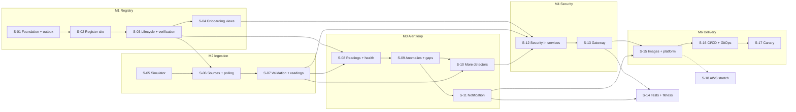

# Roadmap: GreenGrid Java PoC

## 1. Summary

**Goal:** the complete core track of the spec is delivered: sites onboard themselves, readings flow from the simulated vendor clouds into health monitoring, anomalies become emails, everything is secured behind one gateway, and a push to main reaches the home-server k3s cluster as a canary that rolls back on its own.
**Approach:** the scope is cut into 18 vertical slices along the spec chapters and the bounded contexts. Each slice is planned with `pplan` only when its dependencies are done, then implemented with `iimplement`. The registry path (S-01…S-04) comes first. The simulator (S-05) can be built in parallel to it. Ingestion, monitoring and notification follow the data flow. Security and gateway come next, then quality gates and delivery. Milestones M0…M6 map to the spec's 10-day plan and to the five-minute demo script (Spec Appendix 3).
**Research:** `docs/research/2026-09-27-greengrid-spec-baseline.md` (commit `9f310e4`) · **Milestones:** 7 · **Slices:** 18 (1 planned, 0 done)

## 2. Milestones

| ID | Milestone | Slices | Demonstrable when | Source |
|---|---|---|---|---|
| M0 | Local stack reliable | S-01 | One command starts a healthy stack with a fixed primary; the README's run-locally steps work | Spec Ch1 |
| M1 | Registry complete | S-01, S-02, S-03, S-04 | A CS agent registers, connects, suspends and reactivates a site over REST; each change is published on the site topic; the pipeline view shows stuck sites | Spec Ch2 |
| M2 | Sites onboard themselves | S-05, S-06, S-07 | Demo step 2: a connected site becomes Active from simulator polls alone (and falls back to ConnectionPending when polls fail); valid readings are published, invalid ones are stored with a reason and can be listed | Spec Ch3 |
| M3 | Alert loop | S-08, S-09, S-10, S-11 | Demo steps 3–5: health overview, offline site → DataGap → email in Mailpit, future timestamps → one RejectionBurst | Spec Ch4 |
| M4 | Secured single entry | S-12, S-13 | Demo step 6: every call goes through the gateway with a Keycloak token; the permission matrix holds; a customer gets 404 for a foreign site's health | Spec Ch5–6 |
| M5 | Quality gates | S-14 | Every core acceptance criterion maps to a named test; a layer breach fails the build; the full suite runs in under 5 minutes | Spec Ch7 |
| M6 | Delivered by GitOps | S-15, S-16, S-17 | Demo step 7: a merged PR reaches the cluster without manual commands; a faulty release rolls back automatically; portfolio definition of done (Spec Appendix 2) | Spec Ch8–9 |

## 3. Slices

### 3.1 Slice map

### 3.2 Slice table

| Slice | Name | Scope | Depends | Milestone | Plan | Status |
|---|---|---|---|---|---|---|
| S-01 | Registry foundation and transactional outbox | BR-002, BR-003 | — | M0, M1 | `docs/plans/2026-09-28-registry-foundation-outbox.md` | approved |
| S-02 | Register a site and its connection | BR-010, BR-011, BR-004, BR-007 | S-01 | M1 | — | not planned |
| S-03 | Site lifecycle and verification (registry side) | BR-013, BR-012 | S-02 | M1 | — | not planned |
| S-04 | Onboarding views | BR-014, BR-015 | S-03 | M1 | — | not planned |
| S-05 | Inverter simulator | BR-037 | — | M2 | — | not planned |
| S-06 | Ingestion sources, polling, brand adapters and poll failures | BR-016, BR-017, BR-018, BR-021, BR-012 | S-03, S-05 | M2 | — | not planned |
| S-07 | Reading validation and publication | BR-019, BR-020, BR-022 | S-06 | M2 | — | not planned |
| S-08 | Monitoring: readings and site health | BR-023, BR-024 | S-03, S-07 | M3 | — | not planned |
| S-09 | Anomalies, data gaps, thresholds and alerts | BR-025, BR-028, BR-029, BR-039 | S-08 | M3 | — | not planned |
| S-10 | Underproduction, rejection-burst and unreachable-source detection | BR-026, BR-027, BR-031 | S-07, S-09 | M3 | — | not planned |
| S-11 | Alert notification | BR-032, BR-033 | S-09 | M3 | — | not planned |
| S-12 | Security in every service | BR-034, BR-035, BR-036, BR-030 | S-04, S-07, S-10 | M4 | — | not planned |
| S-13 | API gateway | BR-038, BR-035 | S-12 | M4 | — | not planned |
| S-14 | Test hardening and architecture fitness | BR-004 | S-11, S-13 | M5 | — | not planned |
| S-15 | Container images and platform by Terraform | BR-005, BR-006 | S-11, S-13 | M6 | — | not planned |
| S-16 | CI/CD and GitOps repository | BR-007 | S-15 | M6 | — | not planned |
| S-17 | Canary releases with automatic rollback | BR-008 | S-16 | M6 | — | not planned |
| S-18 | AWS Terraform modules (stretch) | BR-009 | S-15 | — | — | not planned |

### 3.3 Slice briefs

#### S-01 — Registry foundation and transactional outbox
- **Goal:** the local stack starts reliably, site-registry runs with Mongo transactions and Kafka, and an event appended through the outbox reaches Kafka at least once.
- **Scope:** BR-002, BR-003
- **Handles:** INC-001, INC-003, INC-004, INC-005, INC-007, INC-008, INC-011, INC-031, INC-035 (fix); INC-010, INC-025 (won't fix); decides Q-005, Q-016
- **Depends:** —
- **Delivery:** branches `chore/PLAT-01-site-registry-foundation`, `feature/PLAT-03-outbox`; ADR-003, ADR-004
- **Stretch:** —
- **Notes:** approved plan, 3 phases, 15 tasks. Prerequisite: Docker usable without `sudo`.

#### S-02 — Register a site and its connection
- **Goal:** a CS agent registers a site (with Region and IANA time zone) and adds its connection over REST; `SiteRegistered` and `SiteConnectionConfigured` reach the site topic through the outbox; every PR runs the build on GitHub; the architecture rules exist as a shared test artifact any service can apply.
- **Scope:** BR-010, BR-011; BR-004 (part: domain, application and adapter rules as a shared artifact, applied to site-registry, RD-002); BR-007 (part: PR build only, RD-003)
- **Handles:** INC-006 (fix: architecture rules plus real tests from the first class), INC-026 (part: event catalog, first Bruno requests), INC-028 (part: time zone on the site and in its events)
- **Depends:** S-01
- **Delivery:** branches `chore/PLAT-04-architecture-rules`, `feature/REG-01-register-site`, `feature/REG-02-connection-details`; ADR-001, ADR-002, ADR-010
- **Stretch:** —
- **Notes:** the largest early slice. If planning exceeds 15 tasks, split into S-02a (PR build, ArchUnit, REG-01) and S-02b (REG-02).

#### S-03 — Site lifecycle and verification (registry side)
- **Goal:** a CS agent suspends and reactivates Active sites, and `ReadingSourceVerified` reports (sent by hand in tests) move a site from ConnectionPending through Verifying to Active, once per event even when delivered twice.
- **Scope:** BR-013, BR-012 (part: registry consumer, idempotency via processed event ids, dead-letter topic for unknown sites)
- **Handles:** INC-030 (part: count semantics written into the event catalog); decides Q-014
- **Depends:** S-02
- **Delivery:** branches `feature/REG-04-suspend-reactivate`, `feature/REG-03-verification-registry`
- **Stretch:** —
- **Notes:** spec build order REG-04 before REG-03. The first idempotent consumer with a dead-letter topic here sets the pattern every later consumer reuses (§6). The failure path (Verifying → ConnectionPending) is tested with hand-sent events; end to end it works from S-06.

#### S-04 — Onboarding views
- **Goal:** CS agents and operators see counts per status and the sites stuck in ConnectionPending for more than 48 h, oldest first; with the stretch phase, each site's status history.
- **Scope:** BR-014, BR-015
- **Handles:** —
- **Depends:** S-03
- **Delivery:** branches `feature/REG-05-onboarding-pipeline`, `feature/REG-06-audit-trail`
- **Stretch:** REG-06 audit trail (BR-015) as the last, cuttable phase
- **Notes:** closes M1.

#### S-05 — Inverter simulator
- **Goal:** the simulator module serves 200 deterministic sites in the three vendor styles with their intervals and a daylight curve, and a demo user can inject faults.
- **Scope:** BR-037
- **Handles:** INC-015 (fix via Q-004); decides Q-004
- **Depends:** —
- **Delivery:** branch `feature/SIM-inverter-simulator`
- **Stretch:** —
- **Notes:** parallel track with no dependency; it only needs the build from before the roadmap. No story ID in the spec, so the branch uses `SIM`.

#### S-06 — Ingestion sources, polling and brand adapters
- **Goal:** Ingestion keeps its own list of reading sources from site events, polls each exactly once per interval even with two replicas, normalizes the three vendor payloads, retries failing vendors and reports verification successes and failures, so a connected site becomes Active by itself (or returns to ConnectionPending).
- **Scope:** BR-016, BR-017, BR-018, BR-021, BR-012 (part: ingestion reports `ReadingSourceVerified` and `ReadingSourceFailed`, count reset per Q-014)
- **Handles:** INC-014 (reactivation resumes polling), INC-019 (per-source poll state: watermark and last values), INC-024 (adapter output named in the ubiquitous language first), INC-028 (part: repeated DST hour in local-time payloads), INC-030 (part: count reset), INC-037 (poll concurrency and time budget per tick)
- **Depends:** S-03, S-05
- **Delivery:** branches `feature/ING-01-reading-sources`, `feature/ING-02-polling`, `feature/ING-03-brand-adapters`, `feature/ING-06-poll-failures`, `feature/REG-03-verification-ingestion`; ADR-006
- **Stretch:** —
- **Notes:** starts with the ingestion foundation phase (RD-007); the vendor-DTO architecture rule arrives with the adapters (RD-002). Split hint: S-06a (foundation, ING-01, ING-02) and S-06b (ING-03, ING-06, verification reports).

#### S-07 — Reading validation and publication
- **Goal:** each polled reading is validated in the documented rule order; invalid ones are stored with reason and raw payload, announced, and listable by operators; valid ones are published keyed by site.
- **Scope:** BR-019, BR-020, BR-022
- **Handles:** INC-034 (readings topic partitions, auto-creation and retention); decides Q-015
- **Depends:** S-06
- **Delivery:** branches `feature/ING-04-rejected-readings`, `feature/ING-05-reading-events`, `feature/ING-07-resubmit`; ADR-008
- **Stretch:** ING-07 resubmit and discard (BR-022) as the last, cuttable phase; listing and viewing rejected readings is core (demo step 5, permission matrix)
- **Notes:** valid readings bypass the outbox (Spec L534). ADR-004 already records this exception. Closes M2.

#### S-08 — Monitoring: readings and site health
- **Goal:** Monitoring stores each recorded reading once in a time-series collection, keeps site profiles (status, interval, time zone) from site events, sums daily production per site-local day, and answers the health overview for 200 sites in under 100 ms.
- **Scope:** BR-023, BR-024
- **Handles:** INC-016 (Degraded defined via Q-006), INC-017 (write order and recovery rule), INC-027 (part: Suspended sites show Unknown), INC-028 (part: local-day daily totals, time zone in the site profile); decides Q-006
- **Depends:** S-03, S-07
- **Delivery:** branches `feature/MON-01-readings`, `feature/MON-02-site-health`; ADR-005
- **Stretch:** —
- **Notes:** starts with the monitoring foundation phase (RD-007), including the service metrics that S-17's analysis needs (handler-error counter, timers). Health is derived from readings here; S-09 and S-10 feed anomalies into it. The < 100 ms and < 50 ms p95 targets need a measured test, not an assertion on one call.

#### S-09 — Anomalies, data gaps, thresholds and alerts
- **Goal:** an Active site that stops reporting gets one DataGap anomaly within its max gap and one `AlertTriggered`; operators acknowledge and resolve anomalies and set per-site thresholds.
- **Scope:** BR-025, BR-028, BR-029, BR-039
- **Handles:** INC-012 (per-interval rule, NFR-1 test), INC-013 (manual resolve for OPS), INC-018 and INC-036 (AnomalyOpened and "escalated" via Q-008), INC-027 (part: Active-only detection, gap clock from activation, suspension resolves open anomalies); decides Q-008
- **Depends:** S-08
- **Delivery:** branches `feature/MON-07-anomaly-lifecycle`, `feature/MON-03-data-gaps`, `feature/MON-06-thresholds`; ADR-007
- **Stretch:** —
- **Notes:** the anomaly aggregate and alert publishing come before the first detector; every later detector reuses them. Split hint: S-09a (anomaly lifecycle, alerts, DataGap on default thresholds) and S-09b (MON-06 per-site overrides).

#### S-10 — Underproduction, rejection-burst and unreachable-source detection
- **Goal:** underproduction in daylight (site-local time, Active sites only), rejection bursts and, as stretch, unreachable sources each open exactly one anomaly per site and type, and clear by the agreed rule.
- **Scope:** BR-026, BR-027, BR-031
- **Handles:** INC-028 (part: daylight window in the site's time zone), INC-029 (clearing rules via Q-013); decides Q-013
- **Depends:** S-07, S-09
- **Delivery:** branches `feature/MON-04-underproduction`, `feature/MON-05-rejection-bursts`, `feature/MON-09-unreachable-sources`
- **Stretch:** MON-09 unreachable sources (BR-031) as the last, cuttable phase
- **Notes:** demo step 5 needs this slice.

#### S-11 — Alert notification
- **Goal:** each `AlertTriggered` becomes exactly one email in Mailpit naming site, anomaly type and time; as stretch, alert storms are grouped.
- **Scope:** BR-032, BR-033
- **Handles:** —
- **Depends:** S-09
- **Delivery:** branches `feature/NOT-01-alert-email`, `feature/NOT-02-alert-grouping`
- **Stretch:** NOT-02 grouping (BR-033) as the last, cuttable phase
- **Notes:** first on the spec's cut list. Decide the recipient address while planning (the spec leaves it open). Closes M3 together with S-10.

#### S-12 — Security in every service
- **Goal:** demo users log in with authorization code + PKCE, every service validates JWTs and enforces the permission matrix, and customers see only their own sites (foreign site → 404).
- **Scope:** BR-034, BR-035 (part: service side), BR-036, BR-030
- **Handles:** INC-009 (realm with roles, client, users), INC-021 (issuer host and port)
- **Depends:** S-04, S-07, S-10
- **Delivery:** branches `feature/AUTH-01-login`, `feature/AUTH-02-authentication`, `feature/AUTH-03-permissions`, `feature/MON-08-customer-view`; ADR-009
- **Stretch:** the rest of MON-08 (daily production per site-local day) as the last, cuttable phase, second on the spec's cut list. The ownership-checked customer health read stays core, because AUTH-03's 404 criterion and demo step 6 need it.
- **Notes:** every row of the permission matrix gets a test, including expired token → 401. Split hint: S-12a (realm, resource servers, 401) and S-12b (permission matrix, ownership, MON-08).

#### S-13 — API gateway
- **Goal:** one port routes every user request to its owning service with JWT validation, correlation id, per-route timeouts and a clean 503 when a service is down.
- **Scope:** BR-038, BR-035 (part: gateway side)
- **Handles:** INC-002 (replace the servlet/Mongo starters), INC-023 (rate limiting as stretch), INC-033 (Spring Cloud 2025.0.x bump); decides Q-009 (only whether Deep dive E moves into the core)
- **Depends:** S-12
- **Delivery:** branch `feature/GW-api-gateway`
- **Stretch:** rate limiting as the last, cuttable phase (fourth on the spec's cut list)
- **Notes:** closes M4.

#### S-14 — Test hardening and architecture fitness
- **Goal:** the suite covers every core acceptance criterion with a named test, event contracts are checked on both sides, the architecture rules are complete, and `./mvnw verify` stays under 5 minutes.
- **Scope:** BR-004 (part: no-cycles rule, audit that every service applies the shared rules)
- **Handles:** INC-032 (acceptance-criterion → test audit), INC-026 (part: event contract samples per event version); coverage reports
- **Depends:** S-11, S-13
- **Delivery:** branch `chore/PLAT-04-test-hardening`
- **Stretch:** —
- **Notes:** never cut (Spec L59). Most tests already exist by then (RD-005). This slice audits and fills gaps.

#### S-15 — Container images and platform by Terraform
- **Goal:** each service builds into a small non-root image with probes, and one `terraform apply` installs Argo CD, Argo Rollouts, Strimzi and Prometheus on the home-server k3s with the infra app synced.
- **Scope:** BR-005, BR-006
- **Handles:** INC-020 (per-service Mongo credentials as Kubernetes secrets, Q-007), INC-022 (README describes deployment as it really is), Prometheus scraping of the services; decides Q-007
- **Depends:** S-11, S-13
- **Delivery:** branches `feature/PLAT-05-images`, `feature/PLAT-06-terraform-platform`; `greengrid-gitops` repository created; ADR-003 updated (Mongo operator as next step)
- **Stretch:** —
- **Notes:** can run in parallel to S-14. Needs the home server prepared (k3s installed, other stacks stopped). Split hint: S-15a (PLAT-05 images) and S-15b (PLAT-06 Terraform platform and GitOps infra app).

#### S-16 — CI/CD and GitOps repository
- **Goal:** a push to main builds and publishes changed services' images to GHCR tagged with the commit and updates the GitOps repo; Argo CD syncs with waves.
- **Scope:** BR-007 (part: image publishing and GitOps update; the PR build already exists from S-02)
- **Handles:** —
- **Depends:** S-15
- **Delivery:** branch `feature/PLAT-07-cd-pipeline`; ADR-011
- **Stretch:** —
- **Notes:** needs a fine-grained token or deploy key for the GitOps repo as a repository secret.

#### S-17 — Canary releases with automatic rollback
- **Goal:** each service rolls out 20% → 50% → 100% with Prometheus analysis, and a deliberately faulty release aborts and rolls back by itself under k6 load.
- **Scope:** BR-008
- **Handles:** INC-026 (part: load script for rollout traffic); remaining portfolio items (CI badge, demo recording, known simplifications, links to and from the Rust edition)
- **Depends:** S-16
- **Delivery:** branch `feature/PLAT-08-canary`; ADR-012; README final sections (architecture diagram, deploy, demo script, ADR index)
- **Stretch:** —
- **Notes:** needs the service metrics from S-08 and the scraping from S-15. Rollout analysis is third on the spec's cut list (keep the plain canary). Closes M6.

#### S-18 — AWS Terraform modules (stretch)
- **Goal:** AWS Terraform modules for VPC, EKS and ECR pass `terraform validate` and `tflint` without credentials.
- **Scope:** BR-009
- **Handles:** —
- **Depends:** S-15
- **Delivery:** branch `feature/PLAT-09-aws-modules`
- **Stretch:** the whole slice (Deep dive D)
- **Notes:** only after M6.

### 3.4 Not in this roadmap

| Item | Reason | Where instead |
|---|---|---|
| Deep dives A, B, C, E, F, G, H (Spec Part III) | Optional, after the core is live; each produces a report or branch rather than product scope | ad-hoc research and plans after M6; E only moves into the core if Q-009 says so |
| Frontend, real vendor APIs, billing, production secrets, real AWS deployment | Out of scope for the PoC (Spec L224) | — |
| Parked product ideas (co-op attribution, payback, year-over-year, optimization, trading) | Parked by the spec (Spec L171) | README "Future work" (S-01) |
| Spring Boot 4.1 migration | Future work (Spec L627) | README "Future work" |

## 4. Coverage

### 4.1 Rules

| BR | Slices | Note |
|---|---|---|
| BR-001 | — | Implemented before the roadmap; every slice keeps `./mvnw verify` green (regression guard) |
| BR-002 | S-01 | |
| BR-003 | S-01 | |
| BR-004 | S-02, S-14 | S-02: shared rules (framework-free domain, application ↛ adapter, adapter.in ↮ adapter.out); each service's foundation applies them (RD-007); S-06 adds vendor-DTO confinement; S-14: no cycles and the audit |
| BR-005 | S-15 | |
| BR-006 | S-15 | |
| BR-007 | S-02, S-16 | S-02: PR build (`./mvnw verify` on GitHub Actions); S-16: images to GHCR and GitOps update |
| BR-008 | S-17 | |
| BR-009 | S-18 | Stretch |
| BR-010 | S-02 | |
| BR-011 | S-02 | |
| BR-012 | S-03, S-06 | S-03: registry consumes the verification reports; S-06: ingestion produces them; end-to-end at M2 |
| BR-013 | S-03 | |
| BR-014 | S-04 | |
| BR-015 | S-04 | Stretch phase |
| BR-016 | S-06 | |
| BR-017 | S-06 | |
| BR-018 | S-06 | |
| BR-019 | S-07 | |
| BR-020 | S-07 | |
| BR-021 | S-06 | Poll failures belong with the poller (retry budget per tick, verification failures) |
| BR-022 | S-07 | Stretch phase |
| BR-023 | S-08 | |
| BR-024 | S-08 | |
| BR-025 | S-09 | |
| BR-026 | S-10 | |
| BR-027 | S-10 | |
| BR-028 | S-09 | |
| BR-029 | S-09 | |
| BR-030 | S-12 | Ownership-checked health read is core (AUTH-03); daily production is the stretch phase |
| BR-031 | S-10 | Stretch phase |
| BR-032 | S-11 | |
| BR-033 | S-11 | Stretch phase |
| BR-034 | S-12 | |
| BR-035 | S-12, S-13 | S-12: every service rejects missing/expired tokens; S-13: the gateway does too |
| BR-036 | S-12 | |
| BR-037 | S-05 | |
| BR-038 | S-13 | |
| BR-039 | S-09 | |

### 4.2 Inconsistencies

| INC | Severity | Slices | Disposition | Note |
|---|---|---|---|---|
| INC-001 | Medium | S-01 | Fix | |
| INC-002 | Medium | S-13 | Fix | Replace the starters, don't extend them |
| INC-003 | High | S-01 | Fix | |
| INC-004 | Medium | S-01 | Fix | |
| INC-005 | Medium | S-01 | Fix | |
| INC-006 | Low | S-02 | Fix | ArchUnit from the first domain class (RD-002) |
| INC-007 | Low | S-01 | Fix | |
| INC-008 | High | S-01 | Fix | |
| INC-009 | Low | S-12 | Fix | |
| INC-010 | Low | S-01 | Won't fix | S-01 D-001 keeps `site_registry` |
| INC-011 | Low | S-01 | Fix | |
| INC-012 | High | S-09 | Fix | Resolved by Q-001; BR-039 gets its own test |
| INC-013 | Medium | S-09 | Fix | Resolved by Q-002; manual resolve endpoint for OPS |
| INC-014 | High | S-06 | Fix | Resolved by Q-003; S-03 publishes `SiteReactivated` |
| INC-015 | Low | S-05 | Fix | Via Q-004 |
| INC-016 | Medium | S-08 | Fix | Via Q-006 |
| INC-017 | Medium | S-08 | Fix | Write order and recovery rule in ADR-005 |
| INC-018 | Low | S-09 | Fix | Via Q-008 |
| INC-019 | Medium | S-06 | Fix | Per-source poll state holds watermark and last values; S-07 reads them |
| INC-020 | Medium | S-15 | Fix | Deferred by S-01 (ADR-003); via Q-007 |
| INC-021 | Low | S-12 | Fix | |
| INC-022 | Low | S-15 | Fix | |
| INC-023 | Low | S-13 | Fix | Rate limiting as stretch phase |
| INC-024 | Low | S-06 | Fix | |
| INC-025 | Low | S-01 | Won't fix | The spec lives outside the repo; `docs/domain/` is the source now (RD-006) |
| INC-026 | Low | S-01, S-02, S-14, S-17 | Fix | ADRs from S-01; event catalog and Bruno collection from S-02; contract samples S-14; load script S-17 |
| INC-027 | High | S-08, S-09 | Fix | Resolved by Q-012; S-08 Unknown health, S-09 Active-only detection |
| INC-028 | Medium | S-02, S-06, S-08, S-10, S-12 | Fix | Resolved by Q-011; site model, adapters (DST), local-day totals, daylight window, customer daily view |
| INC-029 | Low | S-10 | Fix | Via Q-013 |
| INC-030 | Medium | S-03, S-06 | Fix | Via Q-014 |
| INC-031 | Medium | S-01 | Fix | |
| INC-032 | Medium | S-14 | Fix | Each slice plan names a test per acceptance criterion (RD-005); S-14 audits |
| INC-033 | Low | S-13 | Fix | |
| INC-034 | Low | S-07 | Fix | Via Q-015; the site topic is declared by S-01 |
| INC-035 | Low | S-01 | Fix | |
| INC-036 | Low | S-09 | Fix | Region part already done in `docs/domain/ubiquitous-language.md` (53daedb); "escalated" via Q-008 |
| INC-037 | Medium | S-06 | Fix | |

### 4.3 Open questions

| Q | Blocking | Status | Decide in / decided by |
|---|---|---|---|
| Q-001 | yes | resolved | Research §8; applied in S-09 |
| Q-002 | yes | resolved | Research §8; applied in S-09 |
| Q-003 | yes | resolved | Research §8; applied in S-03, S-06 |
| Q-004 | no | open | S-05 |
| Q-005 | no | decided | S-01 D-001 |
| Q-006 | no | open | S-08 |
| Q-007 | no | open | S-15 |
| Q-008 | no | open | S-09 |
| Q-009 | no | open | S-13 (ask the recruiter; it only decides whether Deep dive E moves into the core) |
| Q-010 | no | decided | RD-006 |
| Q-011 | yes | resolved | Research §8; applied in S-02, S-06, S-08, S-10, S-12 |
| Q-012 | yes | resolved | Research §8; applied in S-08, S-09 |
| Q-013 | no | open | S-10 |
| Q-014 | no | open | S-03 (registry semantics; S-06 implements the reset) |
| Q-015 | no | open | S-07 |
| Q-016 | no | decided | S-01 D-003 |

## 5. Cross-cutting decisions

| ID | Resolves | Decision | Alternatives rejected | Rationale | ADR |
|---|---|---|---|---|---|
| RD-001 | — | 18 slices, one `pplan` plan each (≤ 4 phases, ≤ 15 tasks); a slice that overflows at planning time is split into `S-##a/b` and logged in §8 | One plan per chapter; one plan for the whole project | Plans stay reviewable and fresh; each slice ends in something demonstrable | — |
| RD-002 | — | ArchUnit rules arrive in S-02 as a shared test artifact, every service applies them from its foundation phase, S-06 adds the vendor-DTO rule, S-14 adds the cycle rule and audits | Keep PLAT-04 in Ch7 as the spec orders it | Layer violations are cheapest to prevent before they exist (INC-006) | — |
| RD-003 | — | A GitHub Actions PR build running the full Maven verify starts in S-02; S-16 adds image publishing and the GitOps update | All CI in Ch9 | Every later slice merges through a green build; Testcontainers runs on GitHub runners | — |
| RD-004 | — | Stretch stories are the last phase of their natural slice and can be cut there; PLAT-09 is its own slice | Separate stretch slices after the core | Stretch work reuses the context the slice already built; cutting stays a one-line decision | — |
| RD-005 | — | Tests are written in the slice that builds the behavior, one named test per acceptance criterion; S-14 audits and adds only cross-cutting layers | A trailing testing slice | Test-first per plan; "never cut the tests" (Spec L59) | — |
| RD-006 | Q-010 | `docs/` in this repo is the single source (domain, research, plans, ADRs); spec corrections go to `docs/domain/`, not back into the external spec | Keep the external spec or Notion as source | Already in place since 53daedb; keeps docs versioned with code | — |
| RD-007 | — | Each service's first slice opens with a foundation phase modelled on S-01 Phase 2 (own configuration, name and port, Testcontainers base, transaction manager and outbox where it publishes, own topics, the shared architecture rules, metrics endpoint) | One foundation slice for all services now | Configuration arrives with the code that needs it; no dead config | — |
| RD-008 | — | Keep the spec's chapter order for security: services are built without authentication until S-12, which then locks every endpoint and tests every permission-matrix row | Security first, in S-02 | Matches the spec's learning path; the matrix test in S-12 catches every endpoint built before | ADR-009 |

## 6. Conventions for every slice plan

- Frontmatter adds `roadmap: docs/plans/2026-09-29-greengrid-roadmap.md` and `slice: S-##`; §2.2 *Not doing* targets name slice IDs.
- Global constraints: the "Rules that shape the code" in `CLAUDE.md` (ubiquitous language, Kafka-only integration, outbox, keying by site id, hexagonal layout, Java style) plus ADR-003 and ADR-004 once written.
- Branch per story, `feat(<STORY>): …` commits, one commit per phase (`CLAUDE.md` Workflow).
- New domain words go to the ubiquitous language first; new or changed events go to the event catalog in the same slice.
- Every consumer is idempotent and has a test that delivers the same event twice: by processed event id, except time-series readings, which use the rule in ADR-005 (Spec L1890).
- Every listener has an error handler with retries and a `.DLT` topic; malformed payloads and domain errors go there without retry (Spec L532).
- Each slice adds Bruno requests for its stories' happy paths, one folder per role (Spec Appendix 2).
- When the plan is written, approved, started or done, update the slice's `Plan` and `Status` cells and the `slices` counts here.

## 7. Risks and cut line

- [Docker unusable without `sudo`] → S-01 Phase 1 prerequisite; blocks every Testcontainers test and the PR build parity.
- [S-02, S-06, S-09, S-12 and S-15 overflow the plan budget] → split hints in their briefs (RD-001).
- [Canary analysis has no metrics to read] → metrics from each service's foundation phase (RD-007, S-08 handler-error counter) and scraping in S-15.
- [Scheduler double-polling during canaries] → S-06 lease and ShedLock tests with two instances; S-17 relies on them (Spec L2213).
- [Home-server resources (16 GB, HDD) too tight for the full stack] → S-15 measures with `kubectl top` and documents limits; kind on the laptop stays the fallback.
- [Security retrofitted late misses an endpoint] → RD-008: S-12 tests every permission-matrix row through each service.
- [Spec drift: decisions made here are not in the external spec] → RD-006: `docs/domain/` is authoritative.
- **Cut order if time runs short (Spec L59):** S-11 notification (S-14 and S-15 then no longer wait for it) → customer daily production (S-12 stretch phase; the ownership-checked health read stays) → rollout analysis in S-17 (keep the plain canary) → gateway rate limiting (S-13 stretch phase). All other stretch phases go before any of these. **Never cut:** S-14 and the tests in every slice.

## 8. Change log

> Append-only. Format: `date — what changed — why — approved by`.

- 2026-09-29 — Roadmap approved — review done — Riadh Gharbi
- 2026-09-29 — Review findings F1–F12 applied: ING-06 moved to S-06, S-11 edges for S-14/S-15, observability assigned, Q-011 applied to S-08/S-12, split hints, architecture rules per service, core rejected-readings list, customer health read core — independent review — Riadh Gharbi
- 2026-09-29 — Roadmap created; S-01 linked to the existing approved plan `2026-09-28-registry-foundation-outbox` (frontmatter `roadmap`/`slice`, §2.2 targets, T-005 CLAUDE.md drift, see its §11) — overarching plan requested — Riadh Gharbi
