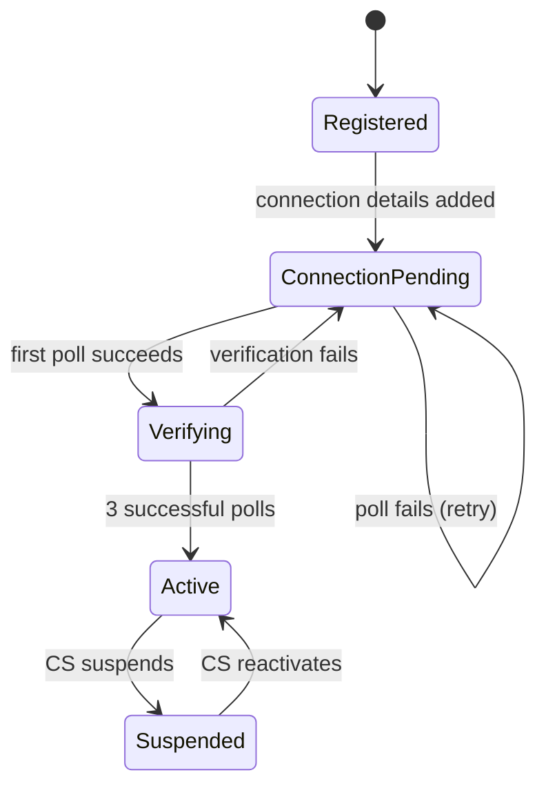
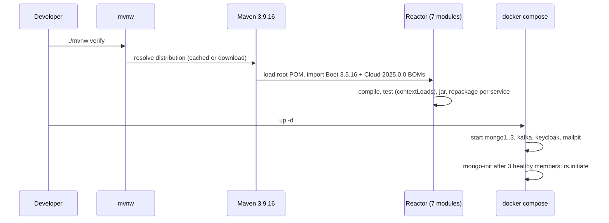
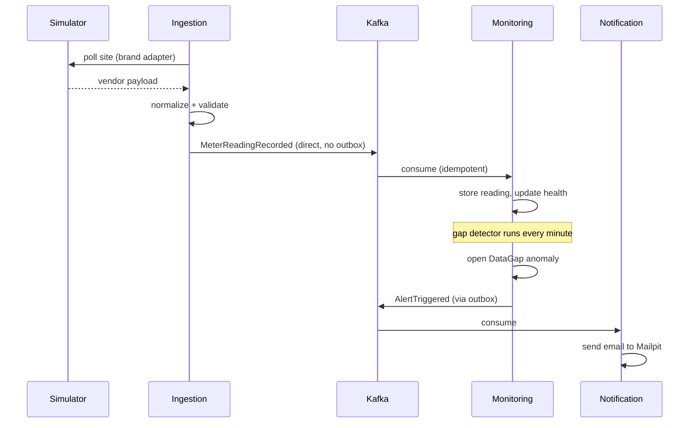

# Research: GreenGrid spec baseline

## 1. Summary

**TL;DR** — GreenGrid Java Edition is specified as a 10-day proof of concept: five Spring Boot services plus an inverter simulator, split along bounded contexts (Site Registry, Ingestion, Monitoring, Notification, Gateway), integrated through versioned events with a transactional outbox, secured by Keycloak, and delivered by GitOps to a local k3s cluster. The repository today contains exactly the Chapter 1 scaffold: a building multi-module Maven reactor (parent + 6 modules = 7 reactor projects, 5/5 `contextLoads` tests pass), empty hexagonal packages per service, an empty `greengrid-events` library, and a Compose file for the MongoDB replica set, Kafka (KRaft), Keycloak and Mailpit. All 36 stories except PLAT-01 (implemented) and PLAT-02 (partial) are not started. The most important findings are two Compose defects — a misspelled Kafka controller setting that likely prevents the broker from starting (INC-008) and a missing replica-set priority that Chapter 2's connection string depends on (INC-003) — plus copy-pasted service names (INC-001) and several gaps inside the spec. Five design-changing gaps were settled with the user on 2026-09-27 (§8): per-interval detection (INC-012), active-only detection (INC-027), resuming polling after reactivation (INC-014), a site time zone (INC-028) and manual resolve by operators (INC-013). The remaining spec gaps (INC-017, INC-019, INC-029…INC-031, INC-037) are deferrable and belong to the Chapter 3/4 plans.

**Research type:** planned-feature · **Scope:** the whole spec (Part I specification, Part II chapters 1–9, Part III and appendices) compared against every tracked file of the repo at `9f310e4`, plus a real `./mvnw -B verify` run. · **Out of scope:** the separate `greengrid-gitops` repository (does not exist yet), runtime verification of the Compose stack (containers were not started), web research.

**Research questions**
1. What does the repository implement today, compared with the spec's repository layout and the Chapter 1 stories PLAT-01/PLAT-02? → §3.2, §4
2. How is the build set up (parent, version pins, modules, per-service dependencies) and does it match the spec's pins? → §3.2 TC-001…TC-003, §3.5
3. What does the local infrastructure provide (Compose services, versions, health checks, Keycloak realm)? → §3.5, TC-010…TC-013
4. What scaffolding does each service have (hexagonal packages, configuration, tests)? → §3.2 TC-004…TC-008, §3.6, §3.7
5. What does `greengrid-events` contain compared with PLAT-03 (envelope + outbox)? → TC-009, BR-003
6. Which business rules does the spec define per epic, and in which order are they built? → §2.2, §2.4
7. What documentation and conventions does the spec expect (ADRs, README sections, branch and commit naming)? → §3.6, INC-005, INC-026

**Key findings**
- The build foundation is real and green: BR-001 is Implemented by TC-001…TC-003; all other capabilities (BR-003…BR-039) are Not implemented, as expected at this stage.
- Local infrastructure is Partial (BR-002): the Compose file parses, but the Kafka controller listener variable is misspelled compared with the spec (INC-008, runtime effect unverified) and mongo-init does not set the priority Chapter 2's `directConnection` URI relies on (INC-003).
- Every service is named `site-registry` at runtime (INC-001); the gateway module is a copy of a servlet service rather than a gateway (INC-002).
- The README misses what Chapter 1 marks as done and uses the wrong Compose file name (INC-004, INC-005).
- The spec leaves design-changing gaps: 15-minute detection vs. 2×interval gap rule (INC-012), suspended sites still raising DataGap alerts (INC-027), reactivated sites never polled again (INC-014), no site time zone although daylight and daily totals depend on it (INC-028), manual resolve and clearing conditions unspecified (INC-013, INC-029), verification count never reset (INC-030), partial-failure hole in reading storage (INC-017).
- Five blocking questions (Q-001, Q-002, Q-003, Q-011, Q-012) were answered on 2026-09-27 (§8); eleven deferrable questions remain.

## 2. Business View

> Behavior as observed from outside: users, operators, other systems. No class names, frameworks, databases, protocols or file paths in rule statements. Technical counterparts: see §3 and §4.

### 2.1 Context & Actors

| Actor | Role | Interacts via |
|---|---|---|
| CS Agent (Tomás, Maria) | Registers sites, configures connections, moves sites through onboarding, suspends/reactivates | Demo requests through the gateway (no frontend) |
| Operator (Diana) | Watches site health, acknowledges anomalies, configures thresholds, reviews rejected readings | Demo requests through the gateway; alert emails |
| Customer (site owner) | Sees own sites' health and daily production only | Demo requests through the gateway |
| Product Owner (Sana) | Wants a credible replacement for spreadsheets and fragile scripts | Demo script, README |
| Inverter vendor clouds (SolarEdge, Fronius, Enphase) | Provide readings, each with its own format and interval | Polled by the system (simulated in the PoC) |
| Developer / release manager | Builds, runs locally, releases through canaries | Build, local environment, pipeline |

GreenGrid Solutions (fictional) monitors about 200 prosumer solar sites in 3 regions; today one person checks a spreadsheet every morning, outages go unnoticed for 2–3 days, zero production is ambiguous, invalid readings were silently dropped, and onboarding takes 2 days to 2 weeks (Spec L98–117). The PoC replaces that loop with automated ingestion, health monitoring and alerting, and is explicitly a skills showcase (Spec L7). Out of scope: frontend, real vendor APIs, billing, multi-tenancy beyond ownership, production secret management, real AWS deployment (Spec L224); parked items: co-op attribution, payback, year-over-year, optimization, trading (Spec L171).

### 2.2 Business Rules & Requirements

Source notation: "Spec L123" = line in *GreenGrid — Java Microservices Edition: Spec & Build Guide* (Sep 24, 2026). Track (Core/Stretch) is given in Notes. The PLAT rules (BR-001…BR-009) describe what developers and release managers observe, so some delivery vocabulary (build, image, pipeline) is unavoidable there; all other rules avoid implementation terms.

#### BR-001 — PLAT-01 Shared build for all modules
- **Rule:** WHEN a developer runs the build from a fresh clone THE BUILD SHALL compile every module against shared version pins and pass all tests.
- **Status:** Implemented
- **Source:** Spec L290, L599, L612–693
- **Implemented by:** TC-001, TC-002, TC-003
- **Notes:** Core. Verified by running `./mvnw -B verify`: BUILD SUCCESS, 7/7 reactor projects, 5 tests, 0 failures (55 s).

#### BR-002 — PLAT-02 Local environment in one command
- **Rule:** WHEN a developer starts the local environment with one command THE ENVIRONMENT SHALL provide a three-member replicated document store, a message broker, the identity provider and a mail catcher, all reporting healthy.
- **Status:** Partial
- **Source:** Spec L291, L695–787, L821
- **Implemented by:** TC-010, TC-011, TC-012, TC-013
- **Notes:** Core. Definition parses (`docker compose config`); containers were not started in this research. Kafka controller setting misspelled (INC-008); member priority missing (INC-003); health checks do not prove the replica set exists (INC-035).

#### BR-003 — PLAT-03 Reliable event publication
- **Rule:** WHEN a service saves a change to an aggregate THE SERVICE SHALL record the resulting event atomically with the change and deliver it to subscribers at least once, in order per aggregate.
- **Status:** Not implemented
- **Source:** Spec L292, L1022–1152, L529
- **Implemented by:** — (placeholder only: TC-009)
- **Notes:** Core. Relay every 500 ms, single runner, batches of 100, marks sent only after acknowledgement (Spec L1093–1123). Poison entries and lock sizing unspecified (INC-031).

#### BR-004 — PLAT-04 Architecture rules enforced
- **Rule:** IF domain code depends on framework, persistence, messaging or serialization types THEN THE BUILD SHALL fail.
- **Status:** Not implemented
- **Source:** Spec L293, L2070–2085
- **Implemented by:** —
- **Notes:** Core. Five rules: framework-free domain, application independent of adapters, inbound/outbound adapters independent, vendor models confined, no cycles.

#### BR-005 — PLAT-05 Deployable service images
- **Rule:** WHEN a service is built for deployment THE BUILD SHALL produce an image under 250 MB that runs as non-root and exposes health probes.
- **Status:** Not implemented
- **Source:** Spec L294, L2135
- **Implemented by:** —
- **Notes:** Core.

#### BR-006 — PLAT-06 Platform provisioned as code
- **Rule:** WHEN the platform code is applied to the home-server cluster THE PLATFORM SHALL install continuous delivery, progressive delivery, the broker operator and metrics, and report the infrastructure application as synced; removing it SHALL leave the cluster clean.
- **Status:** Not implemented
- **Source:** Spec L295, L2133–2148
- **Implemented by:** —
- **Notes:** Core.

#### BR-007 — PLAT-07 Continuous integration and publication
- **Rule:** WHEN a change is pushed to the main line THE PIPELINE SHALL run all tests, publish images tagged with the commit and update the declared deployment state.
- **Status:** Not implemented
- **Source:** Spec L296, L2192–2194
- **Implemented by:** —
- **Notes:** Core.

#### BR-008 — PLAT-08 Canary releases with automatic rollback
- **Rule:** WHEN a new version is deployed THE PLATFORM SHALL shift traffic 20% → 50% → 100% with automated analysis, and IF the error rate exceeds 5% THEN THE PLATFORM SHALL roll back automatically.
- **Status:** Not implemented
- **Source:** Spec L297, L2195–2196, L2205
- **Implemented by:** —
- **Notes:** Core. Traffic weights are approximated by replica counts (Spec L2195).

#### BR-009 — PLAT-09 Cloud modules validated without credentials
- **Rule:** WHEN the cloud infrastructure code is validated THE VALIDATION SHALL pass without cloud credentials.
- **Status:** Not implemented
- **Source:** Spec L298, L2308–2315
- **Implemented by:** —
- **Notes:** Stretch (Deep dive D).

#### BR-010 — REG-01 Register a site
- **Rule:** WHEN a CS agent registers a site with valid customer, region and installation data THE REGISTRY SHALL create it in status Registered with its time zone (derived from the region unless given) and announce SiteRegistered; IF capacity is not above 0 kWp or battery capacity is negative THEN THE REGISTRY SHALL reject it with a domain error.
- **Status:** Not implemented
- **Source:** Spec L306, L1154–1427
- **Implemented by:** — (host: TC-004)
- **Notes:** Core. Time zone added per Q-011 (2026-09-27): IANA zone on the site, carried in SiteRegistered and SiteConnectionConfigured. The acceptance criterion says "location", the model says Region (INC-036). Site ids are `site-` + UUID; timestamps truncated to milliseconds; shape errors 400, domain errors 422, not found 404, conflicts 409 (Spec L1165, L1287, L1389–1399).

#### BR-011 — REG-02 Add connection details
- **Rule:** WHEN a CS agent adds connection details to a Registered or ConnectionPending site THE REGISTRY SHALL set status ConnectionPending and announce SiteConnectionConfigured; IF the connection brand differs from the installation brand THEN THE REGISTRY SHALL reject it.
- **Status:** Not implemented
- **Source:** Spec L307, L1429–1476
- **Implemented by:** — (host: TC-004)
- **Notes:** Core. The credential is a reference, never the secret, and is never returned to callers (Spec L1433–1443, L1471).

#### BR-012 — REG-03 Verification moves sites forward
- **Rule:** WHEN the first successful poll of a ConnectionPending site is reported THE REGISTRY SHALL move it to Verifying, and WHEN three successful polls have been reported THE REGISTRY SHALL move it to Active and announce SiteActivated; IF verification fails while Verifying THEN THE REGISTRY SHALL return the site to ConnectionPending and reset its count.
- **Status:** Not implemented
- **Source:** Spec L308, L500, L1514–1642
- **Implemented by:** — (hosts: TC-004, TC-005)
- **Notes:** Core. Duplicate reports are ignored; reports for Active/Suspended sites are ignored; unknown sites go to a dead-letter channel (Spec L1532–1579, L1640). The ingestion-side count is never reset after a failure (INC-030).

#### BR-013 — REG-04 Suspend and reactivate
- **Rule:** WHEN a CS agent suspends an Active site with a reason THE REGISTRY SHALL set it Suspended, announce SiteSuspended and polling SHALL stop; WHEN a CS agent reactivates a Suspended site THE REGISTRY SHALL set it Active and announce SiteReactivated.
- **Status:** Not implemented
- **Source:** Spec L309, L1478–1512
- **Implemented by:** — (host: TC-004)
- **Notes:** Core. On reactivation Ingestion resumes normal polling (Q-003, BR-016).

#### BR-014 — REG-05 Onboarding pipeline view
- **Rule:** WHEN a CS agent or operator queries the onboarding pipeline THE REGISTRY SHALL return counts per status and the sites stuck in ConnectionPending for longer than 48 hours, oldest first.
- **Status:** Not implemented
- **Source:** Spec L310, L1644–1696
- **Implemented by:** — (host: TC-004)
- **Notes:** Core. Threshold configurable, default 48 h.

#### BR-015 — REG-06 Audit trail of status changes
- **Rule:** WHEN a site changes status THE REGISTRY SHALL record who changed what, when and why, and show the history oldest first.
- **Status:** Not implemented
- **Source:** Spec L311, L1698–1718
- **Implemented by:** —
- **Notes:** Stretch.

#### BR-016 — ING-01 Local list of sources to poll
- **Rule:** WHEN a site's connection is configured or the site is activated THE INGESTION SERVICE SHALL create or update its reading source without calling the registry; WHEN a site is suspended THE INGESTION SERVICE SHALL stop polling it; WHEN a site is reactivated THE INGESTION SERVICE SHALL resume polling it in normal mode without re-verification.
- **Status:** Not implemented
- **Source:** Spec L319, L1784
- **Implemented by:** — (host: TC-005)
- **Notes:** Core. Reactivation clause added per Q-003 (2026-09-27); not yet in the spec's ING-01.

#### BR-017 — ING-02 Poll on the brand interval, exactly once
- **Rule:** WHEN a source's interval elapses THE INGESTION SERVICE SHALL poll it exactly once, even when two instances run.
- **Status:** Not implemented
- **Source:** Spec L320, L1785
- **Implemented by:** — (host: TC-005)
- **Notes:** Core. Scheduler tick 30 s, atomic claim with lease. Only Enphase's interval (60 min) is identifiable (INC-015); concurrency unspecified (INC-037); per-source state unplaced (INC-019).

#### BR-018 — ING-03 One adapter per vendor
- **Rule:** WHEN a SolarEdge, Fronius or Enphase payload is received THE INGESTION SERVICE SHALL turn it into a normalized Meter Reading in UTC and kWh, and vendor formats SHALL NOT reach any other part of the system.
- **Status:** Not implemented
- **Source:** Spec L321, L1786, L1814
- **Implemented by:** — (host: TC-005)
- **Notes:** Core.

#### BR-019 — ING-04 Invalid readings kept, never dropped
- **Rule:** IF a reading has a future timestamp (more than 5 minutes ahead), a negative value, a counter reset, a duplicate timestamp or a malformed payload THEN THE INGESTION SERVICE SHALL keep it with its reason and raw payload and announce ReadingRejected.
- **Status:** Not implemented
- **Source:** Spec L183, L322, L1787–1788, L200
- **Implemented by:** — (host: TC-005)
- **Notes:** Core. Auditability NFR-5. Where the previous counter/timestamps live is unspecified (INC-019).

#### BR-020 — ING-05 Valid readings as events
- **Rule:** WHEN a reading passes validation THE INGESTION SERVICE SHALL announce MeterReadingRecorded, ordered per site.
- **Status:** Not implemented
- **Source:** Spec L323, L534, L1788
- **Implemented by:** — (host: TC-005)
- **Notes:** Core. Valid readings are not stored by Ingestion; the event log is their system of record.

#### BR-021 — ING-06 Poll failures surfaced
- **Rule:** IF a vendor call keeps failing after three attempts with exponential backoff THEN THE INGESTION SERVICE SHALL announce ReadingSourceFailed and postpone the next poll.
- **Status:** Not implemented
- **Source:** Spec L324, L1789
- **Implemented by:** — (host: TC-005)
- **Notes:** Core.

#### BR-022 — ING-07 Resubmit or discard rejected readings
- **Rule:** WHEN an operator resubmits a rejected reading with a note THE INGESTION SERVICE SHALL reprocess it bypassing the failed rule, record the reviewer and mark it Resubmitted.
- **Status:** Not implemented
- **Source:** Spec L183, L325, L1792
- **Implemented by:** —
- **Notes:** Stretch. "Discard" is named in FR-3 but never specified further.

#### BR-023 — MON-01 Readings stored once as time series
- **Rule:** WHEN a recorded reading is received, even more than once, THE MONITORING SERVICE SHALL store it exactly once in the site's time series.
- **Status:** Not implemented
- **Source:** Spec L333, L1886–1890
- **Implemented by:** — (host: TC-006)
- **Notes:** Core. Idempotency approach differs from the general rule (INC-017).

#### BR-024 — MON-02 Site health overview
- **Rule:** WHEN an operator asks for the health overview THE MONITORING SERVICE SHALL return status, last reading time and open anomaly count per site for 200 sites in under 100 ms, and one site's day of readings in under 50 ms at p95.
- **Status:** Not implemented
- **Source:** Spec L334, L198, L1891, L1900
- **Implemented by:** — (host: TC-006)
- **Notes:** Core. Degraded is still undefined (INC-016); Suspended sites show Unknown (Q-012).

#### BR-025 — MON-03 Data gaps detected
- **Rule:** WHILE a site is Active, IF no reading arrives within its maximum gap (default twice its interval), counted from its last reading or from its activation, THEN THE MONITORING SERVICE SHALL open a DataGap anomaly and mark the site Offline.
- **Status:** Not implemented
- **Source:** Spec L335, L1892, L1895, L1919
- **Implemented by:** — (host: TC-006)
- **Notes:** Core. Authoritative detection rule per Q-001 (BR-039 restated); which site statuses are checked is unspecified (INC-027).

#### BR-026 — MON-04 Underproduction detected
- **Rule:** WHILE a site is Active and it is daylight at the site, IF production stays below the minimum ratio of the expected baseline (default 40%) for 3 consecutive intervals THEN THE MONITORING SERVICE SHALL open an Underproduction anomaly.
- **Status:** Not implemented
- **Source:** Spec L336, L1893, L1896, L1910
- **Implemented by:** — (host: TC-006)
- **Notes:** Core. Daylight is given only as an example (08:00–18:00, Spec L1893) and is evaluated in the site's own time zone (Q-011); baseline = capacity × clear-sky factor × interval.

#### BR-027 — MON-05 Rejection bursts detected
- **Rule:** IF a site has 5 consecutive rejected readings or more than 20% rejected within one hour THEN THE MONITORING SERVICE SHALL open a single RejectionBurst anomaly.
- **Status:** Not implemented
- **Source:** Spec L337, L1897, L1911
- **Implemented by:** — (host: TC-006)
- **Notes:** Core.

#### BR-028 — MON-06 Configurable thresholds
- **Rule:** WHEN an operator sets a per-site threshold override THE MONITORING SERVICE SHALL use it instead of the default; IF a ratio above 1 or a gap factor below 1 is given THEN THE MONITORING SERVICE SHALL reject it.
- **Status:** Not implemented
- **Source:** Spec L338, L1874, L1892
- **Implemented by:** — (host: TC-006)
- **Notes:** Core.

#### BR-029 — MON-07 Anomaly lifecycle and alerts
- **Rule:** WHEN an anomaly opens THE MONITORING SERVICE SHALL raise exactly one AlertTriggered; WHEN an operator acknowledges an Open anomaly THE MONITORING SERVICE SHALL mark it Acknowledged; WHEN an operator resolves an Open or Acknowledged anomaly with a note, or the condition clears, THE MONITORING SERVICE SHALL mark it Resolved.
- **Status:** Not implemented
- **Source:** Spec L339, L1873, L1877, L1899
- **Implemented by:** — (host: TC-006)
- **Notes:** Core. At most one active anomaly per site and type. Manual resolve by OPS added per Q-002 (2026-09-27); not yet in the spec's Chapter 4.

#### BR-030 — MON-08 Customers see only their own sites
- **Rule:** WHEN a customer asks for health or daily production THE SYSTEM SHALL return only the customer's own sites, and IF the customer asks for another customer's site THEN THE SYSTEM SHALL answer "not found".
- **Status:** Not implemented
- **Source:** Spec L189, L340, L1960–1963
- **Implemented by:** —
- **Notes:** Stretch (built in Ch5). "Daily" means the site's local day (Q-011).

#### BR-031 — MON-09 Unreachable sources become anomalies
- **Rule:** WHEN a Poll Failure is reported for a site THE MONITORING SERVICE SHALL open a SourceUnreachable anomaly.
- **Status:** Not implemented
- **Source:** Spec L341, L1898
- **Implemented by:** —
- **Notes:** Stretch.

#### BR-032 — NOT-01 Alerts by email
- **Rule:** WHEN an alert is raised THE NOTIFICATION SERVICE SHALL send one email naming the site, anomaly type and time, and IF the same alert arrives again THEN THE NOTIFICATION SERVICE SHALL NOT send it twice.
- **Status:** Not implemented
- **Source:** Spec L188, L349, L1905
- **Implemented by:** — (host: TC-007)
- **Notes:** Core. Recipient address is not specified.

#### BR-033 — NOT-02 No alert storms
- **Rule:** WHEN 10 alerts for one site arrive within 5 minutes THE NOTIFICATION SERVICE SHALL group them into one email.
- **Status:** Not implemented
- **Source:** Spec L350, L1905
- **Implemented by:** —
- **Notes:** Stretch.

#### BR-034 — AUTH-01 Log in and obtain a token
- **Rule:** WHEN a demo user completes the authorization-code login with PKCE THE IDENTITY PROVIDER SHALL issue a token carrying the user's role (OPS, CS or CUSTOMER).
- **Status:** Not implemented
- **Source:** Spec L358, L1960, L1978
- **Implemented by:** — (TC-012 provides only an empty realm)
- **Notes:** Core. Five demo users: 1 operator, 2 CS agents, 2 customers; no password grant.

#### BR-035 — AUTH-02 Every request authenticated
- **Rule:** IF a request carries no token or an expired token THEN THE SYSTEM SHALL answer "unauthorized", both at the gateway and when a service is called directly.
- **Status:** Not implemented
- **Source:** Spec L190, L359, L1961, L2015
- **Implemented by:** — (hosts: TC-004…TC-008)
- **Notes:** Core.

#### BR-036 — AUTH-03 Permission matrix enforced
- **Rule:** THE SYSTEM SHALL allow each role exactly the capabilities of the permission matrix; IF a CS agent tries to resolve an anomaly THEN THE SYSTEM SHALL answer "forbidden"; IF a customer reads another customer's site THEN THE SYSTEM SHALL answer "not found".
- **Status:** Not implemented
- **Source:** Spec L207–218, L360, L1962–1970
- **Implemented by:** —
- **Notes:** Core. Depends on the manual resolve capability (INC-013).

#### BR-037 — Simulated vendor clouds
- **Rule:** THE SIMULATOR SHALL serve readings for 200 deterministic sites in three vendor styles with their own intervals and a daylight production curve, and SHALL let a demo user inject offline, future-timestamp, counter-reset, underproduction and error faults.
- **Status:** Not implemented
- **Source:** Spec L448, L1775–1780, L1965
- **Implemented by:** — (TC-014 notes the empty module folder)
- **Notes:** Core enabler without a story ID. Protected by a static key.

#### BR-038 — Single resilient gateway
- **Rule:** THE GATEWAY SHALL route every user request to the owning service on one port, tag it with a correlation id, and IF a service is down THEN THE GATEWAY SHALL answer "service unavailable" promptly instead of hanging.
- **Status:** Not implemented
- **Source:** Spec L190, L447, L2011–2025
- **Implemented by:** — (host: TC-008)
- **Notes:** Core (FR-10, Ch6); rate limiting is Stretch (INC-023).

#### BR-039 — NFR-1 Detection latency
- **Rule:** WHEN a site stops sending data THE SYSTEM SHALL detect it within the site's maximum gap (default twice its interval), which is at most 15 minutes for 5-minute sites.
- **Status:** Not implemented
- **Source:** Spec L175, L196
- **Implemented by:** —
- **Notes:** Core NFR. Restated per Q-001 (2026-09-27); the spec's "within 15 minutes" wording (Spec L175, L196, L373) should be updated to match.

### 2.3 Business Flows

**Onboarding (target)**
1. A CS agent registers a site with customer, region and installation (BR-010) → Registered.
2. The agent adds vendor connection details (BR-011) → ConnectionPending; Ingestion learns about the source without calling the registry (BR-016).
3. Ingestion polls the source (BR-017, BR-018); the first success moves the site to Verifying, three successes to Active (BR-012).
4. Failures while verifying send the site back to ConnectionPending (BR-012); the pipeline view shows sites stuck more than 48 h (BR-014).
5. A CS agent may suspend and later reactivate the site (BR-013).



**Reading to alert (target)**
1. Ingestion polls an Active site on its interval and normalizes the payload (BR-017, BR-018).
2. Invalid readings are kept with a reason and announced (BR-019); valid ones are announced (BR-020).
3. Monitoring stores each reading once (BR-023) and updates site health (BR-024).
4. Missing data, underproduction, rejection bursts or unreachable sources open anomalies (BR-025, BR-026, BR-027, BR-031) using configurable thresholds (BR-028).
5. Each new anomaly raises one alert (BR-029), which becomes one email (BR-032, BR-033).
6. The operator acknowledges; the anomaly resolves when the condition clears (BR-029).

**Access (target)** — users log in (BR-034), every request is authenticated at the entry point and in each service (BR-035, BR-038), and the permission matrix decides what each role can do (BR-036, BR-030).

**Developer loop (today)** — clone, build and test with one command (BR-001), start local infrastructure with one command (BR-002).

### 2.4 Intended Capability

The spec defines 6 epics and 36 stories, 30 Core and 6 Stretch (Spec L271–280), delivered over 9 chapters in 10 days (Spec L44–57):

| Epic | Stories (BR) | Chapter | State today |
|---|---|---|---|
| PLAT — Platform and delivery | BR-001…BR-009 | Ch1, 2, 7, 8, 9, Deep dive D | BR-001 done, BR-002 partial |
| REG — Site Registry and onboarding | BR-010…BR-015 | Ch2 (REG-03 also Ch3) | not started |
| ING — Data Ingestion | BR-016…BR-022 | Ch3 | not started |
| MON — Site Health Monitoring | BR-023…BR-031 | Ch4 (MON-08 in Ch5) | not started |
| NOT — Alert Notification | BR-032, BR-033 | Ch4 | not started |
| AUTH — Authentication and authorization | BR-034…BR-036 | Ch5, Ch6 | not started |
| (no epic) simulator, entry point, NFR-1 | BR-037, BR-038, BR-039 | Ch3, Ch6, Ch4 | not started |

Chapter 2 build order: foundation → PLAT-03 → REG-01 → REG-02 → REG-04 → REG-03 → REG-05 → REG-06, one branch per story named after the story ID, merged to main when its tests pass (Spec L271, L886). If a day slips, the spec cuts in this order: notification, customer read endpoint, rollout analysis, gateway rate limiting (Spec L59).

## 3. Technical View

> How the code realizes the business view. Every claim cites `path:line`. Business counterparts: see §2 and §4.

### 3.1 Architecture Overview

Target architecture from the spec (Spec L420–448), with what exists today. Every service module exists as an empty Spring Boot application; none of the arrows below is implemented yet.

```mermaid
C4Container
  title GreenGrid — containers (target; all services currently empty scaffolds)
  Person(cs, "CS agent")
  Person(ops, "Operator")
  Person(cust, "Customer")
  System_Ext(sim, "inverter-simulator (planned)", "Fakes 3 vendor APIs")
  System_Boundary(gg, "GreenGrid") {
    Container(gw, "gateway", "Spring Boot (scaffold)", "Routing, JWT, correlation id")
    Container(reg, "site-registry", "Spring Boot (scaffold)", "Sites, onboarding")
    Container(ing, "ingestion", "Spring Boot (scaffold)", "Polling, validation")
    Container(mon, "monitoring", "Spring Boot (scaffold)", "Health, anomalies")
    Container(notif, "notification", "Spring Boot (scaffold)", "Alert email")
    ContainerQueue(kafka, "Kafka", "KRaft, compose", "Site, reading, source, alert topics")
    ContainerDb(mongo, "MongoDB rs0", "3 members, compose", "One database per service")
  }
  System_Ext(kc, "Keycloak", "Empty realm greengrid")
  System_Ext(mail, "Mailpit", "SMTP catcher")
  Rel(cs, gw, "Uses")
  Rel(ops, gw, "Uses")
  Rel(cust, gw, "Uses")
  Rel(gw, reg, "Routes")
  Rel(gw, ing, "Routes")
  Rel(gw, mon, "Routes")
  Rel(ing, sim, "Polls")
  Rel(reg, kafka, "Site events")
  Rel(ing, kafka, "Reading and source events")
  Rel(mon, kafka, "Alert events")
  Rel(notif, kafka, "Consumes alerts")
  Rel(reg, mongo, "registry db")
  Rel(ing, mongo, "ingestion db")
  Rel(mon, mongo, "monitoring db")
  Rel(notif, mail, "Sends")
  UpdateLayoutConfig($c4ShapeInRow="4", $c4BoundaryInRow="1")
```

Context map (Spec L391–418): Registry is upstream of Ingestion and Monitoring (open host service with versioned site events); Ingestion protects itself from vendors with one anti-corruption adapter per brand and reports poll outcomes back to Registry; Monitoring is upstream of Notification; Keycloak is a generic subdomain. The only synchronous calls are user → gateway and Ingestion → vendor (Spec L364, ADR-002).

### 3.2 Components

#### TC-001 — Root POM and reactor
- **Responsibility:** Parent for all modules: Spring Boot parent, Java version, Spring Cloud BOM, module list.
- **Location:** `pom.xml:7-49`
- **Entry points:** `./mvnw verify` from the repo root; reactor order follows `pom.xml:26-32`.
- **Realizes:** BR-001
- **Depends on:** Maven Central (`spring-boot-starter-parent` 3.5.16 at `pom.xml:7-12`, `spring-cloud-dependencies` 2025.0.0 at `pom.xml:23` and `pom.xml:39-49`)
- **Notes:** Coordinates `com.greengrid:greengrid-parent:0.1.0-SNAPSHOT` (`pom.xml:14-18`); `java.version` 17 (`pom.xml:21`); `tools/inverter-simulator` commented out (`pom.xml:33-36`). No `<build>` or `<dependencies>` section. Matches the spec's root POM (Spec L629–681) except that all module folders already exist and are listed.

#### TC-002 — Maven wrapper and JDK pin
- **Responsibility:** Reproducible toolchain without a local Maven install.
- **Location:** `.mvn/wrapper/maven-wrapper.properties:1-3`, `mvnw:1-295`, `.sdkmanrc:3`
- **Entry points:** `./mvnw`, `mvnw.cmd`, `sdk env`
- **Realizes:** BR-001
- **Depends on:** Maven 3.9.16 distribution (`.mvn/wrapper/maven-wrapper.properties:3`), Temurin `17.0.20-tem` (`.sdkmanrc:3`)
- **Notes:** Wrapper 3.3.4, `distributionType=only-script`, no checksum configured. Observed JDK: Temurin 17.0.20+8.

#### TC-003 — Service module template
- **Responsibility:** Shared dependency and build setup copied into each service.
- **Location:** `services/site-registry/pom.xml:5-101` (identical in all five services except the artifactId on line 11)
- **Entry points:** —
- **Realizes:** BR-001
- **Depends on:** TC-001
- **Notes:** Starters actuator, data-mongodb, validation, web (`services/site-registry/pom.xml:31-46`); Lombok optional (`services/site-registry/pom.xml:48-52`); starter-test (`services/site-registry/pom.xml:53-57`); spring-boot-maven-plugin (`services/site-registry/pom.xml:62-65`); compiler plugin with Lombok annotation processing for main and test (`services/site-registry/pom.xml:66-101`). `java.version` re-declared (`services/site-registry/pom.xml:28`), `<name/>` empty (`services/site-registry/pom.xml:12`).

#### TC-004 — site-registry application
- **Responsibility:** Future owner of sites and the onboarding lifecycle; today an empty Spring Boot application.
- **Location:** `services/site-registry/src/main/java/com/greengrid/site_registry/SiteRegistryApplication.java:6-11`
- **Entry points:** `main` (`services/site-registry/src/main/java/com/greengrid/site_registry/SiteRegistryApplication.java:9-11`)
- **Realizes:** — (scaffold only; will host BR-010…BR-015 and part of BR-012)
- **Depends on:** TC-003
- **Notes:** Package `com.greengrid.site_registry` (the spec uses `siteregistry`, INC-010). Config is a single key `spring.application.name=site-registry` (`services/site-registry/src/main/resources/application.properties:1`).

#### TC-005 — ingestion application
- **Responsibility:** Future poller, vendor adapters and validation; today empty.
- **Location:** `services/ingestion/src/main/java/com/greengrid/ingestion/IngestionApplication.java:6-11`
- **Entry points:** `main` (`services/ingestion/src/main/java/com/greengrid/ingestion/IngestionApplication.java:9-11`)
- **Realizes:** — (scaffold only; will host BR-016…BR-022 and part of BR-012)
- **Depends on:** TC-003
- **Notes:** Name configured as `site-registry` (`services/ingestion/src/main/resources/application.properties:1`, INC-001).

#### TC-006 — monitoring application
- **Responsibility:** Future time-series store, health, thresholds and anomalies; today empty.
- **Location:** `services/monitoring/src/main/java/com/greengrid/monitoring/MonitoringApplication.java:6-11`
- **Entry points:** `main` (`services/monitoring/src/main/java/com/greengrid/monitoring/MonitoringApplication.java:9-11`)
- **Realizes:** — (scaffold only; will host BR-023…BR-031, BR-039)
- **Depends on:** TC-003
- **Notes:** Name configured as `site-registry` (`services/monitoring/src/main/resources/application.properties:1`).

#### TC-007 — notification application
- **Responsibility:** Future alert email sender; today empty.
- **Location:** `services/notification/src/main/java/com/greengrid/notification/NotificationApplication.java:6-11`
- **Entry points:** `main` (`services/notification/src/main/java/com/greengrid/notification/NotificationApplication.java:9-11`)
- **Realizes:** — (scaffold only; will host BR-032, BR-033)
- **Depends on:** TC-003
- **Notes:** Name configured as `site-registry` (`services/notification/src/main/resources/application.properties:1`). No mail starter yet.

#### TC-008 — gateway application
- **Responsibility:** Future single entry point; today an empty servlet-stack application identical to the others.
- **Location:** `services/gateway/src/main/java/com/greengrid/gateway/GatewayApplication.java:6-11`
- **Entry points:** `main` (`services/gateway/src/main/java/com/greengrid/gateway/GatewayApplication.java:9-11`)
- **Realizes:** — (scaffold only; will host BR-038 and the entry-point half of BR-035)
- **Depends on:** TC-003
- **Notes:** Dependencies are web, data-mongodb, validation, actuator (`services/gateway/pom.xml:30-46`); no Spring Cloud Gateway or resource-server starter (INC-002). Name configured as `site-registry` (`services/gateway/src/main/resources/application.properties:1`).

#### TC-009 — greengrid-events library
- **Responsibility:** Future shared event envelope and transactional outbox relay; today a package declaration only.
- **Location:** `platform/greengrid-events/pom.xml:7-46`, `platform/greengrid-events/src/main/java/com/greengrid/events/package-info.java:1`
- **Entry points:** —
- **Realizes:** — (placeholder for BR-003)
- **Depends on:** TC-001; Jackson databind and JSR-310 (`platform/greengrid-events/pom.xml:20-28`)
- **Notes:** Mongo and Kafka starters commented out with "Needed in Chapter 2" (`platform/greengrid-events/pom.xml:30-39`). No test sources although starter-test is declared (`platform/greengrid-events/pom.xml:41-45`). No service depends on it yet.

#### TC-010 — MongoDB replica set (Compose)
- **Responsibility:** Three-member replica set `rs0` for transactions (outbox) and change streams.
- **Location:** `infra/compose/docker-compose.yaml:1-44`, `infra/compose/docker-compose.yaml:85-88`
- **Entry points:** host ports 27017/27018/27019 (`infra/compose/docker-compose.yaml:5`, `infra/compose/docker-compose.yaml:14`, `infra/compose/docker-compose.yaml:23`)
- **Realizes:** BR-002
- **Depends on:** image `mongo:7.0` (`infra/compose/docker-compose.yaml:3`)
- **Notes:** Health check via `mongosh` ping (`infra/compose/docker-compose.yaml:7-10`). One-shot `mongo-init` waits for all three to be healthy and runs `rs.initiate` only if `rs.status()` fails (`infra/compose/docker-compose.yaml:30-44`). Members advertise `mongoN:27017` with default priorities (`infra/compose/docker-compose.yaml:42-44`).

#### TC-011 — Kafka broker (KRaft)
- **Responsibility:** Event backbone, single node without ZooKeeper.
- **Location:** `infra/compose/docker-compose.yaml:46-65`
- **Entry points:** `localhost:9092` from the host, `kafka:19092` inside the network (`infra/compose/docker-compose.yaml:53-54`)
- **Realizes:** BR-002
- **Depends on:** image `apache/kafka:4.0.0` (`infra/compose/docker-compose.yaml:47`)
- **Notes:** Combined broker/controller (`infra/compose/docker-compose.yaml:52`), replication factors 1 (`infra/compose/docker-compose.yaml:59-61`), health check via `kafka-broker-api-versions.sh` (`infra/compose/docker-compose.yaml:62-65`). No volume: topics reset on `down`. The controller listener variable differs from the spec (`infra/compose/docker-compose.yaml:57`, INC-008).

#### TC-012 — Keycloak and realm
- **Responsibility:** Identity provider in dev mode, importing the `greengrid` realm.
- **Location:** `infra/compose/docker-compose.yaml:67-79`, `infra/keycloak/greengrid-realm.json:1-4`
- **Entry points:** `:8080` (`infra/compose/docker-compose.yaml:70`); admin/admin (`infra/compose/docker-compose.yaml:72-73`)
- **Realizes:** BR-002 (and the future home of BR-034)
- **Depends on:** image `quay.io/keycloak/keycloak:26.0` (`infra/compose/docker-compose.yaml:68`)
- **Notes:** Realm file contains only name and enabled flag (`infra/keycloak/greengrid-realm.json:2-3`) — exactly the Chapter 1 starting point (Spec L787). Health check on management port 9000 (`infra/compose/docker-compose.yaml:76-79`).

#### TC-013 — Mailpit
- **Responsibility:** Catches alert emails locally.
- **Location:** `infra/compose/docker-compose.yaml:81-83`
- **Entry points:** SMTP `:1025`, web UI `:8025` (`infra/compose/docker-compose.yaml:83`)
- **Realizes:** BR-002 (and the future sink of BR-032)
- **Depends on:** image `axllent/mailpit`, untagged (`infra/compose/docker-compose.yaml:82`)
- **Notes:** No health check declared in Compose (the image may ship its own; not verified).

#### TC-014 — Scaffold tests and placeholders
- **Responsibility:** One context-start test per service; empty simulator folder.
- **Location:** `services/ingestion/src/test/java/com/greengrid/ingestion/IngestionApplicationTests.java:6-11` (same shape in all five services), `tools/inverter-simulator/.gitkeep`
- **Entry points:** Surefire during `./mvnw verify`
- **Realizes:** BR-001
- **Depends on:** TC-003
- **Notes:** `@SpringBootTest` with an empty `contextLoads` (`services/ingestion/src/test/java/com/greengrid/ingestion/IngestionApplicationTests.java:9-11`). They pass with no MongoDB reachable (driver logs connection refused, context still starts).

### 3.3 Data Flow

**Today — build and local environment** (the only flows that exist)



1. `mvnw` reads the distribution URL and runs the cached Maven 3.9.16 — `.mvn/wrapper/maven-wrapper.properties:3`
2. Maven resolves the Spring Boot parent 3.5.16 from Maven Central — `pom.xml:7-12`
3. The Spring Cloud 2025.0.0 BOM is imported — `pom.xml:39-49`
4. Modules build in declaration order; none depends on another — `pom.xml:26-32`
5. Each service compiles with Lombok on the processor path — `services/site-registry/pom.xml:70-84`
6. Each service runs its `contextLoads` test — `services/site-registry/src/test/java/com/greengrid/site_registry/SiteRegistryApplicationTests.java:6-11`
7. Each service is repackaged as an executable jar — `services/site-registry/pom.xml:62-65`
8. Compose starts Mongo members with `--replSet rs0` — `infra/compose/docker-compose.yaml:4`
9. `mongo-init` waits for three healthy members and initiates the set — `infra/compose/docker-compose.yaml:33-44`

**Target — reading to alert** (Spec L476–498; nothing implemented)



**Target — onboarding verification** (Spec L500): Registry publishes SiteConnectionConfigured → Ingestion creates a source in verification mode and polls → publishes ReadingSourceVerified with a running count → Registry moves the site to Verifying, then Active after 3 polls, publishes SiteActivated → Ingestion switches the source to normal mode.

### 3.4 Data Model & Contracts

Nothing exists in code yet (no domain classes, documents, events or endpoints). The spec's planned contracts:

**Event envelope** (Spec L462–474, L1041–1054): `eventId` (UUID, drives idempotency), `eventType`, `eventVersion`, `occurredAt`, `aggregateId`, `producer`, `payload`. JSON, all topics keyed by siteId.

| Topic | Producer | Consumers | Events | Partitions |
|---|---|---|---|---|
| `greengrid.registry.site.v1` | site-registry | ingestion, monitoring | SiteRegistered, SiteConnectionConfigured, SiteActivated, SiteSuspended, SiteReactivated | 3 |
| `greengrid.ingestion.reading.v1` | ingestion | monitoring | MeterReadingRecorded, ReadingRejected | 6 |
| `greengrid.ingestion.source.v1` | ingestion | site-registry, monitoring | ReadingSourceVerified, ReadingSourceFailed | 3 |
| `greengrid.monitoring.alert.v1` | monitoring | notification | AlertTriggered, AnomalyResolved | 3 |
| each topic + `.DLT` | error handler | manual inspection | poison messages | 1 |

**Planned persistence per service** (Spec L443–446, L1867–1875)

| Service | Database / collections |
|---|---|
| site-registry | `greengrid_registry`: `sites` (indexes customerId, status+statusChangedAt), `outbox`, `processed_events` |
| ingestion | `reading_sources`, `rejected_readings`, `poll_state`, `outbox` |
| monitoring | `readings` (time series, minutes), `site_profiles`, `site_health`, `daily_production`, `anomalies` (partial unique site+type while active), `thresholds`, `processed_events`, `outbox` |
| notification | `notifications` (unique eventId) |

**Planned REST surface** (Spec L443–446, L1376–1696, L1900): `/api/sites/**`, `/api/onboarding/**` (site-registry), `/api/rejected-readings/**` (ingestion), `/api/health/**`, `/api/anomalies/**`, `/api/thresholds/**`, `/api/customer/**` (monitoring) — all through the gateway.

### 3.5 Configuration & Infrastructure

| Item | Today | Spec expectation |
|---|---|---|
| Service config file | `application.properties`, one key `spring.application.name=site-registry` in all five (`services/gateway/src/main/resources/application.properties:1`) | `application.yml` per service with own name, Mongo URI with `directConnection=true`, Kafka producer/consumer settings, port 8081 for registry, topic names (Spec L934–961) |
| Mongo members | 3 × `mongo:7.0`, ports 27017–27019, default priority (`infra/compose/docker-compose.yaml:1-44`) | Same, plus mongo1 `priority: 2` (Spec L739, L964) |
| Kafka | `apache/kafka:4.0.0`, INTERNAL 19092 / EXTERNAL 9092 / CONTROLLER 9093 (`infra/compose/docker-compose.yaml:46-61`); controller listener set via `KAFKA_CONTROLLER_LISTENER_NAME` (`infra/compose/docker-compose.yaml:57`); broker auto-creates topics with defaults | Same listeners, but `KAFKA_CONTROLLER_LISTENER_NAMES` (Spec L753) — see INC-008; topics created by owners with 3/6 partitions (Spec L454–457) — see INC-034 |
| Keycloak | `26.0`, `start-dev --import-realm`, admin/admin, port 8080 (`infra/compose/docker-compose.yaml:67-75`) | Same in Ch1; realm with roles, client, users in Ch5 (Spec L1960) |
| Mailpit | untagged, 8025/1025 (`infra/compose/docker-compose.yaml:81-83`) | Same (Spec L776–778) |
| Version pins | Boot 3.5.16 (`pom.xml:10`), Cloud 2025.0.0 (`pom.xml:23`), Java 17 (`pom.xml:21`) | Boot 3.5.16, Cloud newest 2025.0.x (INC-033), Java 17 (Spec L240–242) |
| Ignore rules | Terraform state/vars, kubeconfig, perf results, secrets already ignored (`.gitignore:42-76`) | Required from Ch8 (Spec L2152) |
| Line endings | `* text=auto eol=lf` (`.gitattributes:2`) | — |

The static check `docker compose -f infra/compose/docker-compose.yaml config --quiet` succeeded (exit 0) — it validates structure, not Kafka or Mongo semantics. No networks or project name are declared; everything runs on the default network. The stack was not started during this research (no Docker socket access), so runtime health is unverified.

### 3.6 Patterns & Conventions

- **Hexagonal packages** (Spec L502–515): `domain`, `application`, `adapter/in`, `adapter/out`, `config`; dependency rule adapter → application → domain; domain free of Spring, Mongo, Kafka, Jackson. Today each service has `domain`, `application`, `adapter.in` and `config` as empty packages (for example `services/site-registry/src/main/java/com/greengrid/site_registry/domain/package-info.java:1`); `adapter.out` does not exist yet in any service.
- **Database per service on a shared replica set; no cross-database reads; no service-to-service REST** (Spec L364, L437, ADR-002/003).
- **Ubiquitous language used verbatim** in class, event, topic and endpoint names (Spec L143).
- **Java style**: records for value objects validated in the compact constructor, sealed interfaces for closed sets, Lombok only outside `domain/` for getters/constructors (Spec L793–816).
- **Delivery conventions**: story IDs in branch names (`feature/REG-01-register-site`) and commit messages (`chore(PLAT-01): monorepo skeleton`), one branch per story (Spec L271, L694, L886). Git history today: a single commit `9f310e4` "First project structure commit" on `main`.
- **ADRs**: 12 ADRs in `docs/adr/`, written chapter by chapter (Spec L554–571); none exist yet.

### 3.7 Tests

| Test | Level | Asserts | Covers |
|---|---|---|---|
| `SiteRegistryApplicationTests`, `IngestionApplicationTests`, `MonitoringApplicationTests`, `NotificationApplicationTests`, `GatewayApplicationTests` (e.g. `services/monitoring/src/test/java/com/greengrid/monitoring/MonitoringApplicationTests.java:6-11`) | `@SpringBootTest` context start | Context starts; nothing else | BR-001 only |

Observed in the build: 5 tests, 0 failures, passing although MongoDB was unreachable. No ArchUnit, Testcontainers, contract samples or slice tests exist. The spec's target test pyramid is domain unit → application with fakes → web slice with security → data slice with Testcontainers → full integration with Awaitility → event contract samples in `contracts/` → ArchUnit (Spec L2056–2066), and every core acceptance criterion must map to a named test (Spec L2090).

### 3.8 Integration Points & Gaps

| BR | Exists to build on | Missing | Constraints |
|---|---|---|---|
| BR-001 | Reactor, wrapper, template (TC-001…TC-003) | — | Keep modules listed only when folders exist; simulator module later |
| BR-002 | Compose stack (TC-010…TC-013) | Kafka controller setting (INC-008); mongo1 priority (INC-003); runtime health not verified here | Host apps cannot resolve `mongoN` hostnames (Spec L826) — hence `directConnection` |
| BR-003 | Library module with Jackson (TC-009) | Envelope, outbox entry/writer/relay, ShedLock, Mongo transaction manager, dependency from services | Needs replica set (TC-010); ShedLock 5.16.0 pin in root POM (Spec L1032) |
| BR-004 | Empty hexagonal packages | ArchUnit rules and dependency | Rules must cover `adapter.out`, which does not exist yet |
| BR-005…BR-009 | `.gitignore` sections for Terraform/kubeconfig/perf | Images, Terraform, GitOps repo, CI workflows, rollouts | Images built in CI only, never on the home server (D-13) |
| BR-010…BR-015 | TC-004 skeleton, TC-012 realm placeholder | Domain, use cases, persistence, outbox wiring, REST, listener, `application.yml` | Chapter 2 base path uses `siteregistry` (INC-010); correct app name (INC-001) |
| BR-016…BR-022 | TC-005 skeleton | Sources, scheduler with lease, adapters, validator, rejected store, topics, per-source state | Simulator (BR-037) must exist first; reactivation (INC-014); per-source state (INC-019); polling concurrency (INC-037) |
| BR-023…BR-031, BR-039 | TC-006 skeleton | Time-series collection, read models, detectors, thresholds, anomaly aggregate | Latency rule conflict (INC-012); health states undefined (INC-016); detector scope (INC-027); time zones (INC-028); write order (INC-017) |
| BR-032, BR-033 | TC-007 skeleton, Mailpit (TC-013) | Mail starter, listener, dedup store | Recipient address unspecified |
| BR-034…BR-036 | Realm file (TC-012) | Roles, client, users, resource-server config in every service, role mapping | Issuer host must match between token and services (Spec L1976) |
| BR-037 | Empty folder (TC-014) | Whole simulator module | Add to `<modules>` only once it has a POM (`pom.xml:33-36`) |
| BR-038 | TC-008 module | Reactive gateway starter, routes, filters, circuit breaker | Must not keep the servlet web starter (INC-002) |

## 4. Traceability Matrix

| BR | Implemented by (TC) | Evidence | Tests | Status |
|---|---|---|---|---|
| BR-001 | TC-001, TC-002, TC-003, TC-014 | `pom.xml:26-32` | 5 × `contextLoads` | Implemented |
| BR-002 | TC-010, TC-011, TC-012, TC-013 | `infra/compose/docker-compose.yaml:30-44` | — (static config check only) | Partial |
| BR-003 | — (TC-009 placeholder) | `platform/greengrid-events/pom.xml:30-39` | — | Not implemented |
| BR-004 | — | — | — | Not implemented |
| BR-005 | — | — | — | Not implemented |
| BR-006 | — | — | — | Not implemented |
| BR-007 | — | — | — | Not implemented |
| BR-008 | — | — | — | Not implemented |
| BR-009 | — | — | — | Not implemented |
| BR-010 | — (host TC-004) | — | — | Not implemented |
| BR-011 | — (host TC-004) | — | — | Not implemented |
| BR-012 | — (hosts TC-004, TC-005) | — | — | Not implemented |
| BR-013 | — (host TC-004) | — | — | Not implemented |
| BR-014 | — (host TC-004) | — | — | Not implemented |
| BR-015 | — | — | — | Not implemented |
| BR-016 | — (host TC-005) | — | — | Not implemented |
| BR-017 | — (host TC-005) | — | — | Not implemented |
| BR-018 | — (host TC-005) | — | — | Not implemented |
| BR-019 | — (host TC-005) | — | — | Not implemented |
| BR-020 | — (host TC-005) | — | — | Not implemented |
| BR-021 | — (host TC-005) | — | — | Not implemented |
| BR-022 | — | — | — | Not implemented |
| BR-023 | — (host TC-006) | — | — | Not implemented |
| BR-024 | — (host TC-006) | — | — | Not implemented |
| BR-025 | — (host TC-006) | — | — | Not implemented |
| BR-026 | — (host TC-006) | — | — | Not implemented |
| BR-027 | — (host TC-006) | — | — | Not implemented |
| BR-028 | — (host TC-006) | — | — | Not implemented |
| BR-029 | — (host TC-006) | — | — | Not implemented |
| BR-030 | — | — | — | Not implemented |
| BR-031 | — | — | — | Not implemented |
| BR-032 | — (host TC-007) | — | — | Not implemented |
| BR-033 | — | — | — | Not implemented |
| BR-034 | — (TC-012 empty realm) | `infra/keycloak/greengrid-realm.json:1-4` | — | Not implemented |
| BR-035 | — | — | — | Not implemented |
| BR-036 | — | — | — | Not implemented |
| BR-037 | — | — | — | Not implemented |
| BR-038 | — (host TC-008) | — | — | Not implemented |
| BR-039 | — | — | — | Not implemented |

**Components without a business rule:** TC-004…TC-009 realize nothing yet — they are scaffolds that will host the rules listed in their *Realizes* notes. TC-009 is not referenced by any service (INC-007).

## 5. Inconsistencies

**Summary** — 37 findings. By category: Config / environment inconsistency 6, Forgotten edge case 6, Doc–code drift 5, Requirement conflict 5, Incomplete feature 4, Ambiguity / underspecification 4, Test gap 3, Terminology drift 3, Architecture / convention violation 1. By severity: **High 5** (INC-003, INC-008, INC-012, INC-014, INC-027), Medium 14, Low 18. Five findings were resolved by the 2026-09-27 clarifications (INC-012, INC-013, INC-014, INC-027, INC-028); the two open High findings are INC-003 and INC-008, both in the Compose file. INC-001…INC-011 and INC-033…INC-035 concern the repository; the others are gaps or contradictions in the spec that the plan will be built from (some also cite repo files). Candidates were produced by an independent reviewer pass and each was checked against both sources before inclusion.

| ID | Category | Severity | Confidence | Location(s) | Links | Summary |
|---|---|---|---|---|---|---|
| INC-001 | Config / environment inconsistency | Medium | Verified | `services/ingestion/src/main/resources/application.properties:1` (+3 more) | TC-005…TC-008 | Four services are named `site-registry` |
| INC-002 | Architecture / convention violation | Medium | Verified | `services/gateway/pom.xml:30-46`; Spec L2013, L2029 | BR-038, TC-008 | Gateway module is a servlet/Mongo copy, not a gateway |
| INC-003 | Config / environment inconsistency | High | Verified | `infra/compose/docker-compose.yaml:42-44`; Spec L739, L964 | BR-002, TC-010 | Replica set lacks the mongo1 priority Chapter 2 relies on |
| INC-004 | Doc–code drift | Medium | Verified | `README.md:28-29`; Spec L695 vs L1422 | BR-002, TC-010 | Compose file is `.yaml`, README and spec say `.yml` |
| INC-005 | Doc–code drift | Medium | Verified | `README.md:24-29`; Spec L627, L822 | BR-001, BR-002 | README lacks what Ch1 marks as done |
| INC-006 | Test gap | Low | Verified | `services/monitoring/src/test/java/com/greengrid/monitoring/MonitoringApplicationTests.java:9-11` | BR-001, BR-004, TC-014 | Tests prove only context start, even without a database |
| INC-007 | Incomplete feature | Low | Verified | `platform/greengrid-events/pom.xml:30-39` | BR-003, TC-009 | Events library is empty and unused |
| INC-008 | Config / environment inconsistency | High | Inferred | `infra/compose/docker-compose.yaml:57`; Spec L753 | BR-002, TC-011 | Kafka controller listener variable misspelled (`_NAME` vs `_NAMES`) |
| INC-009 | Incomplete feature | Low | Verified | `infra/keycloak/greengrid-realm.json:1-4` | BR-034, TC-012 | Realm has no roles, client or users |
| INC-010 | Terminology drift | Low | Verified | `services/site-registry/src/main/java/com/greengrid/site_registry/SiteRegistryApplication.java:1`; Spec L888 | TC-004, Q-005 | Package `site_registry` vs spec `siteregistry` |
| INC-011 | Config / environment inconsistency | Low | Verified | `.gitattributes:2`; `README.md:1` | TC-001, TC-010 | Three files stored with CRLF despite `eol=lf` |
| INC-012 | Requirement conflict | High | Verified | Spec L175, L196, L373 vs L335, L1909, L2401 | BR-025, BR-039, Q-001 | ~~15-minute detection target vs 2×interval gap rule~~ resolved: per-interval (Q-001) |
| INC-013 | Requirement conflict | Medium | Verified | Spec L187, L215, L339, L360 vs L1899 | BR-029, BR-036, Q-002 | ~~Manual resolve required but never specified~~ resolved: OPS only (Q-002) |
| INC-014 | Requirement conflict | High | Verified | Spec L182 vs L319, L1784; L443, L1486 | BR-013, BR-016, Q-003 | ~~Reactivated sites are never polled again~~ resolved: resume normal polling (Q-003) |
| INC-015 | Ambiguity / underspecification | Low | Verified | Spec L150, L1778, L1919 | BR-017, BR-037, Q-004 | SolarEdge vs Fronius interval (15 or 5 min) not stated |
| INC-016 | Ambiguity / underspecification | Medium | Verified | Spec L160, L185 vs L335 | BR-024, Q-006 | Degraded and Unknown health are undefined |
| INC-017 | Forgotten edge case | Medium | Verified | Spec L1890 vs L1891, L533 | BR-023, BR-024 | Crash between reading insert and read-model update loses data |
| INC-018 | Incomplete feature | Low | Verified | Spec L445, L165 vs L457, L1899 | BR-029, Q-008 | AnomalyOpened and "escalated" alerts have no topic or rule |
| INC-019 | Ambiguity / underspecification | Medium | Verified | Spec L1787, L1799, L534 vs L444, L1784 | BR-017, BR-019 | Per-source validation state has no home (`poll_state` unused) |
| INC-020 | Requirement conflict | Medium | Verified | Spec L437, L697 vs L943; `infra/compose/docker-compose.yaml:1-6` | BR-002, TC-010, Q-007 | Per-service credentials vs anonymous connection string |
| INC-021 | Doc–code drift | Low | Verified | Spec L1976 vs `infra/compose/docker-compose.yaml:70` | BR-034, TC-012 | Issuer pitfall cites port 8180; Keycloak runs on 8080 |
| INC-022 | Doc–code drift | Low | Verified | `README.md:3`; Spec L81 vs L230, L2136 | BR-006 | Deployment described as present/k3d-kind; spec says k3s, nothing exists |
| INC-023 | Requirement conflict | Low | Verified | Spec L447 vs L2018, L59 | BR-038 | Rate limiting: gateway responsibility vs stretch/first cut |
| INC-024 | Terminology drift | Low | Verified | Spec L154 vs L1786 | BR-018 | "Raw Reading" means both raw and normalized |
| INC-025 | Doc–code drift | Low | Verified | Spec L599–600 vs L820–822 | BR-001, BR-002 | Ch1 stories "To do" but Done-when ticked |
| INC-026 | Incomplete feature | Low | Verified | Spec L77–85, L556, L1518, L2078 | BR-004, BR-007 | `docs/adr`, `docs/events.md`, `contracts/`, `api/`, `perf/` do not exist |
| INC-027 | Forgotten edge case | High | Verified | Spec L309, L1784 vs L1870–1871, L1895, L1899 | BR-013, BR-025, BR-029, Q-012 | ~~Suspended sites keep raising DataGap alerts~~ resolved: Active sites only (Q-012) |
| INC-028 | Ambiguity / underspecification | Medium | Verified | Spec L1778, L1893, L184 vs L1174, L1450, L1870 | BR-018, BR-026, BR-027, BR-030, Q-011 | ~~No site time zone~~ resolved: IANA zone on the site, local day (Q-011) |
| INC-029 | Forgotten edge case | Low | Verified | Spec L1897–1899, L1873 | BR-027, BR-029, BR-031, Q-013 | RejectionBurst and SourceUnreachable never clear, muting later alerts |
| INC-030 | Forgotten edge case | Medium | Verified | Spec L1790, L1534–1546 | BR-012, BR-016, Q-014 | Ingestion's running verification count is never reset |
| INC-031 | Forgotten edge case | Medium | Inferred | Spec L1093, L1106–1116 | BR-003, TC-009, Q-016 | Outbox relay: one poison entry blocks everything; batch can outlive the lock |
| INC-032 | Test gap | Medium | Verified | Spec L282, L2090 vs L1803–1809, L1907–1914, L1971 | BR-016, BR-017, BR-029, BR-032, BR-035 | Chapters 3–5 name no tests for several acceptance criteria |
| INC-033 | Config / environment inconsistency | Low | Verified | `pom.xml:22-23`; Spec L242, L622 | BR-001, BR-038, TC-001 | Spring Cloud still 2025.0.0, not the newest 2025.0.x |
| INC-034 | Config / environment inconsistency | Low | Inferred | `infra/compose/docker-compose.yaml:50-61`; Spec L454–457, L534, L1142 | BR-002, BR-020, TC-011, Q-015 | Auto-created topics get default partitions; "system of record" has no volume or retention |
| INC-035 | Test gap | Low | Verified | `infra/compose/docker-compose.yaml:7-10`; Spec L291, L788 | BR-002, TC-010 | "Healthy" does not prove the replica set was initiated |
| INC-036 | Terminology drift | Low | Verified | Spec L306 vs L1174; L141–167; L165 | BR-010, BR-026, BR-029 | Location vs Region; Region missing from the ubiquitous language; "escalated" undefined |
| INC-037 | Forgotten edge case | Medium | Inferred | Spec L1785, L1789, L197 | BR-017, BR-021, BR-025 | Serial polling with retries can delay healthy sites into false DataGaps |

#### INC-001 — Four services are named site-registry
- **Category:** Config / environment inconsistency
- **Severity:** Medium
- **Confidence:** Verified
- **Links:** TC-005, TC-006, TC-007, TC-008
- **Evidence:**
  - Expected/stated: each service has its own name (Spec L939 for the registry; CLAUDE.md known issue)
  - Actual: `services/ingestion/src/main/resources/application.properties:1`, `services/monitoring/src/main/resources/application.properties:1`, `services/notification/src/main/resources/application.properties:1`, `services/gateway/src/main/resources/application.properties:1` all set `site-registry`; build logs show `[site-registry]` for every service's test.
- **Suggested next step:** fix each service's name when its chapter converts the file to `application.yml`; the name will feed log prefixes, metrics tags, Kafka client ids and gateway routes, so do it before those exist.

#### INC-002 — Gateway module is a servlet/Mongo copy, not a gateway
- **Category:** Architecture / convention violation
- **Severity:** Medium
- **Confidence:** Verified
- **Links:** BR-038, BR-035, TC-008
- **Evidence:**
  - Expected/stated: gateway is WebFlux-only Spring Cloud Gateway; "`spring-boot-starter-web` breaks the gateway" (Spec L2013, L2029); the gateway owns no database (Spec L447)
  - Actual: `services/gateway/pom.xml:30-46` declares actuator, data-mongodb, validation and web; no Spring Cloud dependency anywhere.
- **Suggested next step:** acceptable until Ch6, but replace the dependency set then rather than adding to it; CLAUDE.md already notes this.

#### INC-003 — Replica set lacks the mongo1 priority Chapter 2 relies on
- **Category:** Config / environment inconsistency
- **Severity:** High
- **Confidence:** Verified
- **Links:** BR-002, BR-003, BR-010, TC-010
- **Evidence:**
  - Expected/stated: `rs.initiate` gives mongo1 `priority: 2` (Spec L739); Chapter 2 Step 0 says this priority is needed because services connect with `directConnection=true` to `localhost:27017` (Spec L943, L964)
  - Actual: `infra/compose/docker-compose.yaml:42-44` initiates all three members with default priority, so any member can become primary.
- **Suggested next step:** add the priority before starting Chapter 2 and recreate the set with `down -v` (Spec L964); otherwise writes from host-run services fail whenever mongo2 or mongo3 is primary.

#### INC-004 — Compose file name differs between docs and repo
- **Category:** Doc–code drift
- **Severity:** Medium
- **Confidence:** Verified
- **Links:** BR-002, TC-010
- **Evidence:**
  - Expected/stated: README commands use `infra/compose/docker-compose.yml` (`README.md:28-29`); the spec uses `.yml` in Ch1 (Spec L695, L787) and `.yaml` in Ch2 (Spec L1422, L1621, L1629)
  - Actual: the file is `infra/compose/docker-compose.yaml` (`infra/compose/docker-compose.yaml:1`); the README commands fail as written.
- **Suggested next step:** align the README (and optionally note the spec's own drift).

#### INC-005 — README lacks what Chapter 1 marks as done
- **Category:** Doc–code drift
- **Severity:** Medium
- **Confidence:** Verified
- **Links:** BR-001, BR-002
- **Evidence:**
  - Expected/stated: Ch1 Done-when "[x] README has a 'Run locally' section" (Spec L822); README should state why 3.5.16 was chosen and list "migrate to Spring Boot 4.1" under future work (Spec L627); parked items as future work (Spec L171)
  - Actual: `README.md:24-29` is "Getting started" with only step 1 (start infra), a code fence that is never closed, no build/run steps, no rationale, no future-work section.
- **Suggested next step:** complete the README section (build, run a service, verify infra) and close the fence; add the rationale and future-work list.

#### INC-006 — Tests prove only context start, even without a database
- **Category:** Test gap
- **Severity:** Low
- **Confidence:** Verified
- **Links:** BR-001, BR-004, TC-014
- **Evidence:**
  - Expected/stated: Chapter 1 only requires `./mvnw verify` to pass (Spec L820); later, architecture rules are enforced by ArchUnit (Spec L293, L2073) and every acceptance criterion maps to a named test (Spec L282, L2090)
  - Actual: each test is an empty `contextLoads` (`services/monitoring/src/test/java/com/greengrid/monitoring/MonitoringApplicationTests.java:9-11`); during the build the Mongo driver logged "Connection refused" for `localhost:27017` and all contexts still started.
- **Suggested next step:** expected at this stage; the Testcontainers base class arrives in Ch2 Step 0 (Spec L1001–1018). Consider adding the ArchUnit rules early rather than in Ch7 so the packages stay clean from the first class.

#### INC-007 — Events library is empty and unused
- **Category:** Incomplete feature
- **Severity:** Low
- **Confidence:** Verified
- **Links:** BR-003, TC-009
- **Evidence:**
  - Expected/stated: shared envelope and outbox relay (Spec L69, L1022–1152)
  - Actual: only `platform/greengrid-events/src/main/java/com/greengrid/events/package-info.java:1`; Mongo and Kafka deps commented out (`platform/greengrid-events/pom.xml:30-39`); no service POM depends on it.
- **Suggested next step:** delivered by PLAT-03 in Ch2; nothing to do now.

#### INC-008 — Kafka controller listener variable misspelled
- **Category:** Config / environment inconsistency
- **Severity:** High
- **Confidence:** Inferred
- **Links:** BR-002, TC-011
- **Evidence:**
  - Expected/stated: the spec's Compose skeleton sets `KAFKA_CONTROLLER_LISTENER_NAMES: CONTROLLER` (Spec L753); KRaft requires the `controller.listener.names` setting
  - Actual: `infra/compose/docker-compose.yaml:57` sets `KAFKA_CONTROLLER_LISTENER_NAME` (singular). The image maps `KAFKA_*` variables to properties, so this becomes the non-existent `controller.listener.name` and the required setting is missing [INFERRED — Docker was not accessible, so the broker was not started]. `docker compose config` does not detect this.
- **Suggested next step:** start Kafka alone (`docker compose -f infra/compose/docker-compose.yaml up kafka`) and read its log; if it fails as expected, add the missing `S`. This contradicts the ticked Ch1 Done-when "healthy … Kafka" (Spec L821) unless the stack was checked before the typo.

#### INC-009 — Realm has no roles, client or users
- **Category:** Incomplete feature
- **Severity:** Low
- **Confidence:** Verified
- **Links:** BR-034, BR-036, TC-012
- **Evidence:**
  - Expected/stated: roles OPS/CS/CUSTOMER, public client `greengrid-api` with PKCE, `customerId` mapper, five demo users (Spec L1960); Ch1 explicitly starts with the minimal realm (Spec L787)
  - Actual: `infra/keycloak/greengrid-realm.json:1-4` contains only name and enabled flag.
- **Suggested next step:** delivered in Ch5; nothing to do now.

#### INC-010 — Package site_registry vs spec siteregistry
- **Category:** Terminology drift
- **Severity:** Low
- **Confidence:** Verified
- **Links:** TC-004, Q-005
- **Evidence:**
  - Expected/stated: every Chapter 2 path uses `com/greengrid/siteregistry/` (Spec L888, L969); the spec explicitly allows keeping `site_registry` and substituting everywhere
  - Actual: `services/site-registry/src/main/java/com/greengrid/site_registry/SiteRegistryApplication.java:1`; CLAUDE.md documents the underscore.
- **Suggested next step:** a conscious choice rather than a defect; confirm once (Q-005, deferrable) so Chapter 2 code does not mix both spellings.

#### INC-011 — Three files stored with CRLF despite eol=lf
- **Category:** Config / environment inconsistency
- **Severity:** Low
- **Confidence:** Verified
- **Links:** TC-001, TC-010
- **Evidence:**
  - Expected/stated: `* text=auto eol=lf` (`.gitattributes:2`)
  - Actual: `git ls-files --eol` reports `i/crlf` for `README.md`, `pom.xml` and `infra/compose/docker-compose.yaml`; they were staged with CRLF in the single commit `9f310e4`, which also added `.gitattributes`.
- **Suggested next step:** renormalize once (`git add --renormalize .`) in a housekeeping commit.

#### INC-012 — 15-minute detection target vs 2×interval gap rule
- **Category:** Requirement conflict
- **Severity:** High
- **Confidence:** Verified
- **Links:** BR-025, BR-039, Q-001
- **Evidence:**
  - Expected/stated: "detect an offline or underperforming site within 15 minutes" (Spec L175); NFR-1 data gap detected ≤ 15 min after the expected reading (Spec L196); architecture driver "Detection within 15 min" (Spec L373)
  - Actual: MON-03 opens DataGap after the max gap, default 2 × interval (Spec L335), i.e. 10, 30 or 120 minutes for 5-, 15- and 60-minute brands; Ch4 Done-when and the demo script accept "within 2 intervals" (Spec L1909, L2401); a pitfall even warns that a flat 15 minutes would flag every 60-minute site (Spec L1919).
- **Suggested next step:** **Resolved 2026-09-27 (Q-001):** the per-interval max gap is authoritative; update NFR-1, the §2 intro and the architecture driver in the spec accordingly.

#### INC-013 — Manual resolve required but never specified
- **Category:** Requirement conflict
- **Severity:** Medium
- **Confidence:** Verified
- **Links:** BR-029, BR-036, INC-029, Q-002
- **Evidence:**
  - Expected/stated: FR-7 lifecycle "open, acknowledge, resolve" (Spec L187); MON-07 "I want to acknowledge and resolve anomalies" (Spec L339); operators "Acknowledge and resolve anomalies" (Spec L215); AUTH-03 expects a CS token resolving an anomaly to get 403 (Spec L360)
  - Actual: Chapter 4 specifies only REST acknowledge and automatic resolve when the condition clears (Spec L1899); no resolve endpoint anywhere.
- **Suggested next step:** **Resolved 2026-09-27 (Q-002):** OPS may resolve manually; add a resolve endpoint to Chapter 4 and keep AUTH-03's "CS resolves → 403" test.

#### INC-014 — Reactivated sites are never polled again
- **Category:** Requirement conflict
- **Severity:** High
- **Confidence:** Verified
- **Links:** BR-013, BR-016, BR-017, INC-027, Q-003
- **Evidence:**
  - Expected/stated: FR-2 — the system polls each active or verifying site (Spec L182); Registry publishes SiteReactivated when a Suspended site becomes Active again (Spec L443, L1486)
  - Actual: ING-01 creates/updates sources on SiteConnectionConfigured or SiteActivated and stops polling on SiteSuspended (Spec L319, L1784); nothing handles SiteReactivated.
- **Current behavior:** WHEN a Suspended site is reactivated THEN the registry shows it Active but ingestion keeps it stopped (as specified), and the gap detector then flags it.
- **Intended behavior:** WHEN a site is reactivated THE INGESTION SERVICE SHALL resume polling it in normal mode [INFERRED from FR-2].
- **Must remain unchanged:** WHILE a site is Suspended THE INGESTION SERVICE SHALL CONTINUE TO not poll it.
- **Suggested next step:** **Resolved 2026-09-27 (Q-003):** Ingestion resumes normal polling on SiteReactivated (nextPollAt = now, no re-verification); add this to ING-01's acceptance criteria and test it in Chapter 3.

#### INC-015 — SolarEdge vs Fronius interval not stated
- **Category:** Ambiguity / underspecification
- **Severity:** Low
- **Confidence:** Verified
- **Links:** BR-017, BR-037, BR-025, Q-004
- **Evidence:**
  - Expected/stated: Inverter Brand "decides adapter and polling interval" (Spec L150); intervals range 5 minutes to 1 hour (Spec L114)
  - Actual: the simulator lists "15 / 5 / 60 min" next to three payload styles without naming brands (Spec L1778); only Enphase is identifiable as 60-minute (Spec L1919).
- **Suggested next step:** fix the remaining two in the simulator configuration (Q-004, deferrable).

#### INC-016 — Degraded and Unknown health are undefined
- **Category:** Ambiguity / underspecification
- **Severity:** Medium
- **Confidence:** Verified
- **Links:** BR-024, INC-027, Q-006
- **Evidence:**
  - Expected/stated: Site Health is Healthy, Degraded, Offline or Unknown, derived, never set by hand (Spec L160), from data gaps, production vs baseline, rejections and poll failures (Spec L185)
  - Actual: only Offline has a rule (DataGap, Spec L335); no criteria for Degraded or Unknown in Ch4.
- **Suggested next step:** define before Ch4 (Q-006), together with the health of Suspended and Verifying sites (Q-012).

#### INC-017 — Crash between reading insert and read-model update loses data
- **Category:** Forgotten edge case
- **Severity:** Medium
- **Confidence:** Verified
- **Links:** BR-023, BR-024
- **Evidence:**
  - Expected/stated: each reading stored exactly once (Spec L333); replaying the readings topic changes no totals (Spec L1912)
  - Actual: the time-series insert runs outside any transaction, guarded by an existence check (Spec L1890), while `site_health`, `daily_production` and `processed_events` are updated in a separate transaction (Spec L1891); the order is not specified. Insert-then-crash: the redelivered event sees "exists" and may skip the daily `$inc`. Transaction-then-crash: `processed_events` says done and the reading is never stored. Old and new pods run side by side during canaries (Spec L533), so "one consumer per site" is not a full guarantee.
- **Suggested next step:** specify the write order and recovery rule in ADR-005 and test it with the replay criterion.

#### INC-018 — AnomalyOpened and "escalated" alerts have no topic or rule
- **Category:** Incomplete feature
- **Severity:** Low
- **Confidence:** Verified
- **Links:** BR-029, Q-008
- **Evidence:**
  - Expected/stated: monitoring publishes AnomalyOpened, AnomalyResolved, AlertTriggered (Spec L445); an Alert is raised when an anomaly is opened "or escalated" (Spec L165)
  - Actual: the alert topic carries only AlertTriggered and AnomalyResolved (Spec L457); Chapter 4 never emits AnomalyOpened and never defines escalation (Spec L1899).
- **Suggested next step:** drop both from the catalog or specify them (Q-008, deferrable).

#### INC-019 — Per-source validation state has no home
- **Category:** Ambiguity / underspecification
- **Severity:** Medium
- **Confidence:** Verified
- **Links:** BR-017, BR-019
- **Evidence:**
  - Expected/stated: CounterReset and DuplicateTimestamp rules need the previous counter and timestamps (Spec L157, L1787); `fetchSince(source, since)` needs a watermark (Spec L1799); ingestion owns a `poll_state` collection (Spec L444)
  - Actual: Ingestion "stores nothing" for valid readings (Spec L534), the reading source holds only siteId, brand, interval, mode, nextPollAt and status (Spec L1784), and `poll_state` is never mentioned again. After a restart it is undefined whether readings are fetched twice (duplicates) or skipped (gaps).
- **Suggested next step:** decide where the watermark and last values live — `poll_state` is the obvious candidate — when planning Chapter 3.

#### INC-020 — Per-service credentials vs anonymous connection string
- **Category:** Requirement conflict
- **Severity:** Medium
- **Confidence:** Verified
- **Links:** BR-002, TC-010, Q-007
- **Evidence:**
  - Expected/stated: "each service has its own database and credentials" (Spec L437); "its own database and user" (Spec L697); NFR-6 least privilege (Spec L201)
  - Actual: the Chapter 2 URI has no credentials (Spec L943); the Compose Mongo members run without authentication (`infra/compose/docker-compose.yaml:1-6`).
- **Suggested next step:** decide whether credentials arrive in Ch8 (Kubernetes secrets) or never in the PoC (Q-007, deferrable) and say so in ADR-003.

#### INC-021 — Issuer pitfall cites port 8180; Keycloak runs on 8080
- **Category:** Doc–code drift
- **Severity:** Low
- **Confidence:** Verified
- **Links:** BR-034, TC-012
- **Evidence:**
  - Expected/stated: pitfall "issuer mismatch (`localhost:8180` vs `keycloak:8080`)" (Spec L1976)
  - Actual: Keycloak is published on 8080 (`infra/compose/docker-compose.yaml:70`, Spec L766).
- **Suggested next step:** when doing Ch5, fix the issuer with `KC_HOSTNAME` using the real port.

#### INC-022 — Deployment described as present or on k3d/kind
- **Category:** Doc–code drift
- **Severity:** Low
- **Confidence:** Verified
- **Links:** BR-006
- **Evidence:**
  - Expected/stated: the spec's layout comment says Terraform applies a "k3d/kind cluster" (Spec L81) while every later mention says k3s on the home server with kind as fallback (Spec L230, L247, L2136)
  - Actual: `README.md:3` says the system "deploys to a local Kubernetes cluster through Terraform, Argo CD and Argo Rollouts" in the present tense; no Terraform, Argo or CI files exist.
- **Suggested next step:** phrase the README as a target until Ch8/Ch9; fix the spec's layout comment.

#### INC-023 — Rate limiting: gateway responsibility vs stretch and first cut
- **Category:** Requirement conflict
- **Severity:** Low
- **Confidence:** Verified
- **Links:** BR-038
- **Evidence:**
  - Expected/stated: the service catalog lists rate limiting as a gateway responsibility (Spec L447)
  - Actual: Chapter 6 makes it stretch (Spec L2018) and the slip plan cuts it (Spec L59).
- **Suggested next step:** treat as stretch; mark it so in the catalog.

#### INC-024 — "Raw Reading" means both raw and normalized
- **Category:** Terminology drift
- **Severity:** Low
- **Confidence:** Verified
- **Links:** BR-018
- **Evidence:**
  - Expected/stated: Raw Reading = vendor payload before normalization (Spec L154)
  - Actual: `VendorReadingClient` returns "normalized RawReadings" (Spec L1786).
- **Suggested next step:** name the adapter output differently to keep the ubiquitous language exact.

#### INC-025 — Chapter 1 stories "To do" but Done-when ticked
- **Category:** Doc–code drift
- **Severity:** Low
- **Confidence:** Verified
- **Links:** BR-001, BR-002
- **Evidence:**
  - Expected/stated: PLAT-01 and PLAT-02 status "To do" (Spec L599–600)
  - Actual: all three Chapter 1 Done-when items are ticked (Spec L820–822); the repo confirms BR-001 but not the README item (INC-005) and possibly not Kafka health (INC-008).
- **Suggested next step:** update the story statuses in the spec once INC-003, INC-005 and INC-008 are resolved.

#### INC-026 — Planned documentation folders do not exist
- **Category:** Incomplete feature
- **Severity:** Low
- **Confidence:** Verified
- **Links:** BR-004, BR-007
- **Evidence:**
  - Expected/stated: `docs/` with ADRs (Spec L85, L556), `docs/events.md` (Spec L1518), `contracts/` (Spec L2078), `api/` Bruno collections (Spec L83), `perf/` (Spec L84)
  - Actual: none of these exist in the tracked tree at `9f310e4`; this research creates the first `docs/` content.
- **Suggested next step:** create `docs/adr/` with ADR-001…003 early, since they document decisions already taken.

#### INC-027 — Suspended sites keep raising DataGap alerts
- **Category:** Forgotten edge case
- **Severity:** High
- **Confidence:** Verified
- **Links:** BR-013, BR-025, BR-029, BR-032, INC-014, Q-012
- **Evidence:**
  - Expected/stated: suspending a site stops polling (Spec L309, L1784) — a deliberate operator action
  - Actual: the DataGap detector scans every `site_health` entry whose `lastReadingAt` is older than the max gap (Spec L1895) with no status filter, although `site_profiles` stores the status (Spec L1870); the anomaly auto-resolves only when a reading arrives (Spec L1899), which never happens while suspended. Conversely `site_health` is written only by reading and anomaly handlers (Spec L1871), so an Active site that never delivers a valid reading is never flagged.
- **Current behavior:** WHEN a site is suspended THEN after 2 × interval a DataGap anomaly opens, the site shows Offline and an email is sent; the anomaly stays open indefinitely (as specified).
- **Intended behavior:** WHEN a site is Suspended THE MONITORING SERVICE SHALL NOT raise gap anomalies for it [INFERRED].
- **Must remain unchanged:** WHILE a site is Active THE MONITORING SERVICE SHALL CONTINUE TO detect gaps, including for sites that never reported.
- **Suggested next step:** **Resolved 2026-09-27 (Q-012):** detect only for Active sites (status from `site_profiles`); on SiteSuspended resolve open anomalies and show health Unknown; on SiteActivated/SiteReactivated start the gap clock so sites that never report are flagged too.

#### INC-028 — No site time zone, yet three rules depend on local time
- **Category:** Ambiguity / underspecification
- **Severity:** Medium
- **Confidence:** Verified
- **Links:** BR-018, BR-026, BR-027, BR-030, Q-011
- **Evidence:**
  - Expected/stated: one vendor style reports Wh "with a local-time string" (Spec L1778) and adapters normalize to UTC (Spec L1814, L155); daylight is "in the site's region" (Spec L1893); readings are "summarized per day" (Spec L184)
  - Actual: no model carries a time zone — not the reading source (Spec L1784), not SiteConnectionConfigured (Spec L1450), not `site_profiles` (Spec L1870); Region is a free code such as "DE-BY" (Spec L1174). The repeated autumn DST hour would produce duplicate local timestamps → DuplicateTimestamp rejections → a possible false RejectionBurst for 5-minute sites (Spec L1787, L337).
- **Suggested next step:** **Resolved 2026-09-27 (Q-011):** store an IANA time zone on the site (derived from Region at registration, overridable), carry it in SiteRegistered and SiteConnectionConfigured, and use the site's local day for daily totals and daylight. Adapters with local-time payloads must handle the repeated DST hour explicitly so it does not become DuplicateTimestamp rejections.

#### INC-029 — RejectionBurst and SourceUnreachable never clear
- **Category:** Forgotten edge case
- **Severity:** Low
- **Confidence:** Verified
- **Links:** BR-027, BR-029, BR-031, INC-013, Q-013
- **Evidence:**
  - Expected/stated: anomalies resolve automatically when the condition clears (Spec L339), illustrated only for DataGap and Underproduction ("a reading arrives, production recovers", Spec L1899)
  - Actual: no clearing condition for RejectionBurst (Spec L1897) or SourceUnreachable (Spec L1898); the partial unique index allows one active anomaly per site and type (Spec L1873); manual resolve is unspecified (INC-013). Once opened, every later burst for that site is suppressed and never alerts.
- **Suggested next step:** manual resolve now exists (Q-002), so these anomalies can be closed by hand; still define automatic clearing rules per type (Q-013, deferrable).

#### INC-030 — Ingestion's running verification count is never reset
- **Category:** Forgotten edge case
- **Severity:** Medium
- **Confidence:** Verified
- **Links:** BR-012, BR-016, Q-014
- **Evidence:**
  - Expected/stated: Ingestion publishes ReadingSourceVerified "with a running success count" (Spec L1790, L500); a failure while Verifying resets the registry's count to 0 (Spec L1542–1546)
  - Actual: the registry takes the maximum of its own and the reported count (Spec L1534) and one event can move a site straight to Active (Spec L1535–1539); nothing says Ingestion resets its count on failure or reconfiguration (Spec L1454).
- **Current behavior:** WHEN verification fails and polling later succeeds THEN the next report (count ≥ 3) activates the site without three fresh polls.
- **Intended behavior:** WHEN verification restarts THE SYSTEM SHALL require a new 3-poll window [INFERRED].
- **Must remain unchanged:** late or duplicate reports SHALL CONTINUE TO be ignored.
- **Suggested next step:** fix the count semantics in `docs/events.md` during REG-03 (Q-014).

#### INC-031 — Outbox relay: one poison entry blocks everything
- **Category:** Forgotten edge case
- **Severity:** Medium
- **Confidence:** Inferred
- **Links:** BR-003, TC-009, Q-016
- **Evidence:**
  - Expected/stated: at-least-once, ordered publication (Spec L292, L529)
  - Actual: the relay stops at the first failure (Spec L1113–1116) with no attempt limit or parking, so an entry that can never be sent blocks all later events of that service; a batch of 100 with a 10 s ack timeout (Spec L1109, L1112) can outlive `lockAtMostFor = PT30S` (Spec L1106), letting a second replica relay concurrently and break ordering [INFERRED].
- **Suggested next step:** decide how poison entries are handled and size the lock against the worst-case batch (Q-016) when implementing PLAT-03.

#### INC-032 — Chapters 3–5 name no tests for several acceptance criteria
- **Category:** Test gap
- **Severity:** Medium
- **Confidence:** Verified
- **Links:** BR-016, BR-017, BR-024, BR-029, BR-032, BR-035
- **Evidence:**
  - Expected/stated: every acceptance criterion maps to at least one named test (Spec L282, L2090); Chapter 2 names its tests per story (Spec L1412–1414, L1639–1640)
  - Actual: Chapters 3 and 4 have only Done-when checklists (Spec L1803–1809, L1907–1914). Without a test design: exactly one poll with 2 replicas (ING-02), suspension stops polling (ING-01), AlertTriggered exactly once (MON-07), duplicate alerts ignored (NOT-01), health under 100 ms (MON-02), expired token → 401 (AUTH-02; Ch5 checks only "no token", Spec L1971 vs L359).
- **Suggested next step:** list named tests per acceptance criterion when planning Chapters 3–5.

#### INC-033 — Spring Cloud still 2025.0.0
- **Category:** Config / environment inconsistency
- **Severity:** Low
- **Confidence:** Verified
- **Links:** BR-001, BR-038, TC-001
- **Evidence:**
  - Expected/stated: "use the newest 2025.0.x" (Spec L242, L622)
  - Actual: `pom.xml:22-23` keeps the "bump" comment and 2025.0.0; gateway artifact and property names changed within the train (Spec L2013), so the patch level matters by Chapter 6.
- **Suggested next step:** bump before Chapter 6.

#### INC-034 — Auto-created topics and an unretained "system of record"
- **Category:** Config / environment inconsistency
- **Severity:** Low
- **Confidence:** Inferred
- **Links:** BR-002, BR-020, BR-023, TC-011, Q-015
- **Evidence:**
  - Expected/stated: topics with 3 or 6 partitions created by their owners (Spec L454–457, L1142); Kafka is the system of record for valid readings (Spec L534, D-7 at L261)
  - Actual: the broker keeps default auto-creation (no related settings in `infra/compose/docker-compose.yaml:50-61`), so a consumer that starts first — or a Kafka restart without a volume — creates 1-partition topics [INFERRED from Kafka defaults]; no retention is specified anywhere.
- **Suggested next step:** decide whether to disable auto-creation locally and what retention "system of record" implies (Q-015).

#### INC-035 — "Healthy" does not prove the replica set was initiated
- **Category:** Test gap
- **Severity:** Low
- **Confidence:** Verified
- **Links:** BR-002, TC-010
- **Evidence:**
  - Expected/stated: PLAT-02 asks for a healthy 3-member replica set (Spec L291, L821)
  - Actual: member health checks only ping (`infra/compose/docker-compose.yaml:7-10`) and nothing depends on `mongo-init` completing (`infra/compose/docker-compose.yaml:30-44`); only the manual `rs.status()` step checks the set (Spec L788).
- **Suggested next step:** keep the manual check in the README's run-locally section.

#### INC-036 — Location vs Region; Region and "escalated" undefined
- **Category:** Terminology drift
- **Severity:** Low
- **Confidence:** Verified
- **Links:** BR-010, BR-026, BR-029
- **Evidence:**
  - Expected/stated: terms are used verbatim (Spec L143); REG-01 says "location" (Spec L306)
  - Actual: the model uses `Region` (Spec L1174), which is missing from the ubiquitous language (Spec L141–167) although it drives the daylight window and health filters (Spec L1893, L1900); "escalated" appears only in the Alert definition (Spec L165).
- **Suggested next step:** add Region to the ubiquitous language; define or drop "escalated".

#### INC-037 — Serial polling can delay healthy sites into false DataGaps
- **Category:** Forgotten edge case
- **Severity:** Medium
- **Confidence:** Inferred
- **Links:** BR-017, BR-021, BR-025
- **Evidence:**
  - Expected/stated: 200 sites at 5-minute intervals with 10× headroom (Spec L197)
  - Actual: due sources are claimed "one at a time" on a 30 s tick (Spec L1785) and each vendor call has a timeout plus 3 retries with backoff (Spec L1789); poll concurrency is unspecified, so injecting HTTP 500s on many sites could delay healthy ones beyond their max gap (Spec L1895) during the demo [INFERRED].
- **Suggested next step:** state poll concurrency and a time budget per tick when planning Chapter 3.

**Further minor findings (spec-internal naming drift, aggregated):** `SiteEvent` placed in `domain/` vs `domain/event/` (Spec L971 vs L1197); `OnboardingPipelineQuery` listed as a use case vs a port, `GetSite`/`GetOnboardingPipeline` missing from the package tree (Spec L975 vs L1648, L1690, L1298); pipeline query described as one aggregation vs aggregation plus find (Spec L882 vs L1659); aggregate method names `markVerified`/`activate` vs `recordSuccessfulPolls`/`verificationFailed` (Spec L875 vs L1531–1546); sealed `SiteEvent` permits list grows (Spec L806 vs L1447, L1486); `processed_events` uniqueness via unique index vs `_id` (Spec L530 vs L1549); story wording drifts for AUTH-02 and REG-03 (Spec L359 vs L1947, L308 vs L1764); foundation branch prefixed `PLAT-01` although PLAT-01 is a Chapter 1 story (Spec L892); DLT retry "with backoff" vs fixed 1 s (Spec L532 vs L1612); MON-08 mapped to Ch4 and Ch5 (Spec L340 vs L1938). **POM hygiene:** empty `<name/>` and metadata blocks in all service POMs (`services/site-registry/pom.xml:12-26`) leave the reactor summary lines blank; `java.version` declared six times (`services/site-registry/pom.xml:28`); no trailing newline in `pom.xml`; untagged Mailpit image (`infra/compose/docker-compose.yaml:82`). **Not findings:** the Spring Cloud BOM and Lombok configuration look unused today but are required by Chapter 1 (Spec L613, L622).

## 6. Glossary

| Term | Kind | Meaning | Where |
|---|---|---|---|
| Site | Domain term | Physical location with solar equipment, owned by one customer | BR-010 |
| Installation | Domain term | Inverter brand, capacity (kWp), optional battery and smart meter | BR-010 |
| Onboarding Status | Domain term | Registered, ConnectionPending, Verifying, Active, Suspended | BR-010…BR-013 |
| Connection | Domain term | Brand + external site id + credential reference | BR-011 |
| Reading Source | Domain term | Ingestion's local view of a site it must poll | BR-016 |
| Meter Reading | Domain term | Normalized reading: site, UTC timestamp, produced/consumed kWh, interval | BR-018, BR-020 |
| Rejected Reading | Domain term | Invalid reading kept with reason and raw payload | BR-019 |
| Site Health | Domain term | Healthy, Degraded, Offline, Unknown — derived | BR-024 |
| Threshold / Baseline | Domain term | Configurable limits; expected production per site and hour | BR-026, BR-028 |
| Anomaly / Alert | Domain term | Detected problem with a lifecycle; notification-worthy fact that it opened (or "escalated", undefined — INC-036) | BR-029 |
| Region | Domain term | Code such as DE-BY; drives health filters and the default time zone, but missing from the spec's ubiquitous language (INC-036) | BR-010, BR-026 |
| Site time zone | Domain term | IANA zone of the site (e.g. Europe/Berlin); defines its local day and daylight window (Q-011) | BR-010, BR-026, BR-030 |
| Poll Failure | Domain term | Vendor API unreachable or erroring for a site | BR-021, BR-031 |
| Bounded context | Concept · NEW | A boundary inside which each term has exactly one meaning; here each one is a service | §3.1 |
| Hexagonal architecture | Concept · NEW | Domain in the middle, ports as interfaces, adapters for web, messaging and storage at the edge | §3.6 |
| Anti-corruption layer | Concept · NEW | One adapter per vendor translating foreign models into the domain's language | BR-018 |
| Transactional outbox | Concept · NEW | Write the event into the same database transaction as the state change; a relay publishes it later | BR-003 |
| Idempotent consumer | Concept · NEW | Remember processed event ids so a redelivered event has no second effect | BR-012, BR-023 |
| MongoDB replica set | Concept · NEW | Three copies of the data with one primary; required for transactions | TC-010 |
| KRaft | Concept · NEW | Kafka's built-in consensus mode that replaces ZooKeeper | TC-011 |
| Time-series collection | Concept · NEW | MongoDB storage optimized for timestamped measurements | BR-023 |
| Dead-letter topic (DLT) | Concept · NEW | Where messages go after retries fail, for manual inspection | BR-012 |
| Lease / ShedLock | Concept · NEW | A lock with an expiry so only one replica runs a scheduled job | BR-003, BR-017 |
| EARS | Concept · NEW | "WHEN … THE SYSTEM SHALL …" requirement patterns used in §2.2 | §2.2 |
| Canary release | Concept · NEW | Shift a share of traffic to a new version, analyze metrics, promote or roll back | BR-008 |
| GitOps / app-of-apps | Concept · NEW | The cluster state is declared in a Git repo that Argo CD keeps in sync | BR-006, BR-007 |

## 7. Open Questions

| ID | Question | Blocking | Why it matters | Recommended answer | Links | Status |
|---|---|---|---|---|---|---|
| Q-001 | Which detection rule is authoritative: 15 minutes for every site (NFR-1) or the per-site max gap, default 2 × interval (MON-03)? | yes | Changes the gap detector, default thresholds, NFR-1 and the demo claim | Keep the per-interval rule (the chapters, done-when and demo already assume it) and restate NFR-1 as "within the site's max gap; ≤ 15 min for 5-minute sites" | INC-012, BR-025, BR-039 | resolved (see §8) |
| Q-002 | Can operators resolve anomalies manually, or only acknowledge them? | yes | AUTH-03's 403 test, the REST surface and INC-029 depend on it | Yes — add manual resolve for OPS; FR-7, MON-07's title and §2.3 all list it | INC-013, BR-029, BR-036 | resolved (see §8) |
| Q-003 | What should Ingestion do when a site is reactivated? | yes | Without a rule, reactivated sites are never polled again and trip the gap detector | Resume polling in normal mode, no re-verification | INC-014, BR-013, BR-016 | resolved (see §8) |
| Q-004 | Which interval do SolarEdge and Fronius use (15 / 5 min; Enphase is 60)? | no | Simulator configuration and baselines | SolarEdge 15 min, Fronius 5 min (order the spec lists payload styles) | INC-015, BR-017, BR-037 | open |
| Q-005 | Keep the package `site_registry` (documented in CLAUDE.md) or switch to the spec's `siteregistry`? | no | Chapter 2 paths use `siteregistry`; the spec allows either | Keep `site_registry` and substitute it in every Chapter 2 path, as the spec allows | INC-010, TC-004 | open |
| Q-006 | What makes a site Degraded (Unknown is now: before the first reading and while Suspended, per Q-012)? | no | Health overview semantics | Degraded while any non-gap anomaly is open | INC-016, BR-024 | open |
| Q-007 | Do services get their own database credentials in the PoC? | no | Least-privilege claim (NFR-6) | Only in Kubernetes (Ch8) via secrets; local stays anonymous | INC-020, BR-002 | open |
| Q-008 | Keep AnomalyOpened and "escalated" alerts? | no | Topic table and consumers | Drop both; AlertTriggered already marks the opening | INC-018, BR-029 | open |
| Q-009 | Does "Gravity basic services" in the posting mean Gravitee? (Spec Appendix 4) | no | Whether Deep dive E becomes core | Ask the recruiter, as the spec says | BR-038 | open |
| Q-010 | Should `docs/` in this repo become the single source instead of the Rust edition's Notion? (Spec Appendix 4) | no | Where spec, ADRs and research live | Yes — this research already starts `docs/` | INC-026 | open |
| Q-011 | Which time zone does a site use, and is "per day" the site's local day or the UTC day? | yes | Changes the site model and events (Chapter 2), adapter normalization, the daylight gate and daily totals | Store an IANA time zone on the site (derived from Region at registration), carry it in site events, and use the site's local day for daily totals | INC-028, BR-018, BR-026, BR-030 | resolved (see §8) |
| Q-012 | Do gap and underproduction detection apply only to Active sites, and what health does a Suspended or Verifying site show? | yes | Otherwise every suspension raises an alert and never resolves | Detect only for Active sites; show Suspended sites as Unknown (or a separate "Suspended" display state) and resolve open anomalies on suspension | INC-027, BR-013, BR-025 | resolved (see §8) |
| Q-013 | What clears a RejectionBurst and a SourceUnreachable anomaly? | no | Otherwise later bursts are muted forever | RejectionBurst clears after N consecutive valid readings; SourceUnreachable on the next successful poll; plus manual resolve (Q-002) | INC-029, BR-027, BR-031 | open |
| Q-014 | After a verification failure or reconfiguration, does Ingestion restart its success count at 0? | no | Sites can activate without three fresh polls | Yes — reset on failure and on SiteConnectionConfigured; document in `docs/events.md` | INC-030, BR-012 | open |
| Q-015 | Should Kafka really be the system of record for valid readings, and with what retention? | no | Replay claims and whether local Kafka needs a volume | Keep D-7 but state retention (e.g. 7 days locally) and add a volume if replay demos matter | INC-034, BR-020 | open |
| Q-016 | What happens to an outbox entry that can never be sent: park it after N attempts, or block? | no | One bad entry halts a service's events | Park after 5 attempts with an error field and log an alert; keep ordering per aggregate | INC-031, BR-003 | open |

## 8. Clarifications

### Session 2026-09-27
- Q-001: Which detection rule is authoritative — 15 minutes for every site or the per-site max gap (default 2 × interval)? → Per-interval max gap; restate NFR-1 as "within the site's max gap, ≤ 15 min for 5-minute sites". Applied to: BR-039 (restated), BR-025, INC-012 (resolved).
- Q-002: Can operators resolve anomalies manually, or only acknowledge them? → Yes, OPS only; auto-resolve stays. Applied to: BR-029 (rule extended), BR-036, INC-013 (resolved), INC-029 (downgraded to Low).
- Q-003: What should Ingestion do when a site is reactivated? → Resume polling in normal mode (next poll immediately), no re-verification. Applied to: BR-016 (rule extended), BR-013, INC-014 (resolved).
- Q-011: Which time zone does a site use, and is "per day" local or UTC? → IANA time zone stored on the site, derived from Region at registration (overridable), carried in site events; daily totals and daylight use the site's local day. Applied to: BR-010 (rule extended), BR-026, BR-030, INC-028 (resolved), glossary.
- Q-012: Which sites do gap/underproduction detection cover, and what health does a Suspended site show? → Active sites only; suspension resolves open anomalies and shows health Unknown; activation and reactivation start the gap clock. Applied to: BR-025, BR-026 (rules scoped to Active), BR-024, INC-027 (resolved), Q-006 (narrowed).

## 9. References

**Code**
- `pom.xml:1-50` — root POM / reactor
- `services/site-registry/pom.xml:1-105` — service module template (identical in all five services)
- `platform/greengrid-events/pom.xml:1-46` — events library POM
- `infra/compose/docker-compose.yaml:1-90` — local infrastructure
- `infra/keycloak/greengrid-realm.json:1-4` — realm
- `README.md:1-29` — project README
- `.gitattributes:1-17`, `.gitignore:1-86`, `.sdkmanrc:1-3`

**Docs**
- *GreenGrid — Java Microservices Edition: Spec & Build Guide* (Sep 24, 2026, 2,410 lines; external file, cited as "Spec L…")
- `CLAUDE.md` (untracked, repository guidance)

**History**
- `9f310e4` — First project structure commit (Riadh Gharbi, 2026-09-26; 53 files)

**Build run**
- `./mvnw -B verify` on 2026-09-27: BUILD SUCCESS, 7/7 modules, 5 tests, 0 failures, 55 s; Mongo unreachable during tests.
- `docker compose -f infra/compose/docker-compose.yaml config --quiet`: exit 0.

**Related research** — none (first research document).
